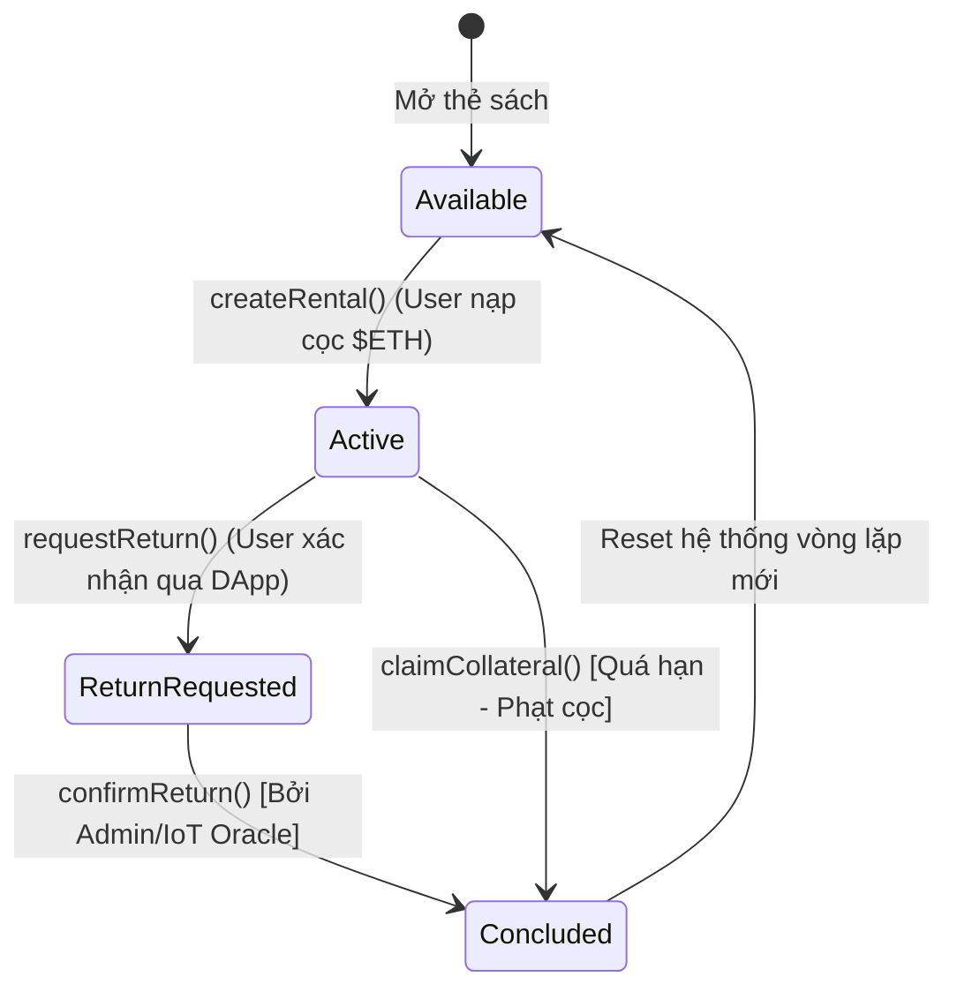

# DESIGN_SPEC — VinaLib (Layer 2 Optimization)
**Phiên bản:** 2.0 | **Ngày:** (Cập nhật) | **Tài sản:** Sách vật lý qua tủ IoT (Physical Book Asset)

## 1. Tham số Kinh tế (Điện toán Layer 2)
- **Chuỗi đích thống nhất (Targeted L2 Protocol):** Khuyến nghị triển khai thẳng lên **Base Mainnet** (phí gas siêu rẻ <$0.005) hoặc **Arbitrum One** ($0.01). 
- **Mô hình định giá:** Fixed Price + Time-based. `P_total = R_rate × ΔT` (Ví dụ: 1$ / 7 ngày).
- **Loại tài sản thế chấp (Collateral Type):** Sử dụng **Native Token ($ETH)** của Base/Arbitrum thay vì ERC-20 (như USDC). 
  *→ Rationale: Giảm thiểu thủ tục gọi hàm `approve()` (tiết kiệm thêm 1 TX fee) khi tạo hợp đồng thuê. Hệ thống Frontend quy đổi tĩnh USD -> ETH qua cặp ETH/USD Oracle tại thời điểm `createRental()`.*
- **Tỷ lệ thế chấp (`k_col`):** `V_deposit >= V_asset × 1.2` (Thế chấp 120% giá trị gốc của sách).
- **Phí phạt quá hạn (Late Fee) & Thanh lý (Liquidation Trigger):** Trừ vào tiền thế chấp dựa trên số ngày trễ (mức 150% phí thuê thông thường). Thanh lý khi số dư cọc bằng 0.

## 2. Kiến trúc Giao thức
Dựa trên Master Workflow, lược đồ giao thức cho tài sản lai L2-IoT như sau:
- **`BookAsset.sol`**: Chuẩn `ERC-721` (Đại diện cho sách là NFT độc bản).
- **`RentalAgreementSBT.sol`**: Chuẩn `ERC-721` không thể chuyển nhượng (Soulbound Token) định danh khế ước mượn sách.
- **`VinaLibVault.sol`**: Quản lý quỹ thế chấp (Treasury) và vòng đời giao dịch thuê.
- **Chiến lược dữ liệu:** 
  - Metadata (Tên sách, ảnh thẻ) -> Lưu IPFS.
  - State (Trạng thái sổ cái thuê sách, Timestamp khóa cọc) -> Lưu On-chain.

## 3. Lược đồ Dữ liệu (Solidity Structs Tối ưu L2)

```solidity
// Trạng thái vòng đời hợp đồng
enum RentalStatus {
    Active,
    ReturnRequested,
    Concluded
}

// Struct tối giản dữ liệu (Slot Packed) nhằm giảm Storage Cost L2
struct EvidencePack {
    bytes32 termsHash;     // 32 Bytes: Mã băm điều khoản thuê (Slot 1)
    bytes32 deliveryHash;  // 32 Bytes: Mã băm giao nhận IoT (Slot 2)
    address renter;        // 20 Bytes: Người mượn (Slot 3)
    uint16 version;        // 2 Bytes: Cấu hình phiên bản (Slot 3)
    RentalStatus status;   // 1 Byte: Trạng thái (Slot 3) -> Pakced cùng address
    uint256 timestamp;     // 32 Bytes: Mốc thời gian (Slot 4)
    string pspRef;         // Dynamic: Reference thanh toán/tủ mã hóa
}

// Cấu trúc Data của NFT Sách
enum BookStatus { PendingVerification, Verified, Rented, Returned }

```

## 4. State Machine (VinaLibVault Logic)
Workflow luồng trạng thái từ khi tạo khoản thuê đến khi trả (phản ứng với tín hiệu cảm biến IoT):



- **Guards (Khóa truy cập):** `createRental` (Bất kỳ ai kèm đủ `msg.value`), `requestReturn` (Chỉ `renter`), `confirmReturn` (Chỉ `Admin` hoặc `Oracle`), `claimCollateral` (Chỉ `onlyOwner` khi timeout).

## 5. Checklist Sẵn sàng (Phục vụ Tích hợp & Deploy)
- [x] Tham số tài chính đã được cấu hình chặt bằng hệ Native Gas Fee Layer 2.
- [x] Token standard (Native/ERC721/SBT) tường minh.
- [x] Struct/Enum thiết lập đảm bảo Slot Packing.
- [x] State flow xử lý liền mạch với chu kỳ trả vật lý từ Tủ/Tín hiệu điện tử.
