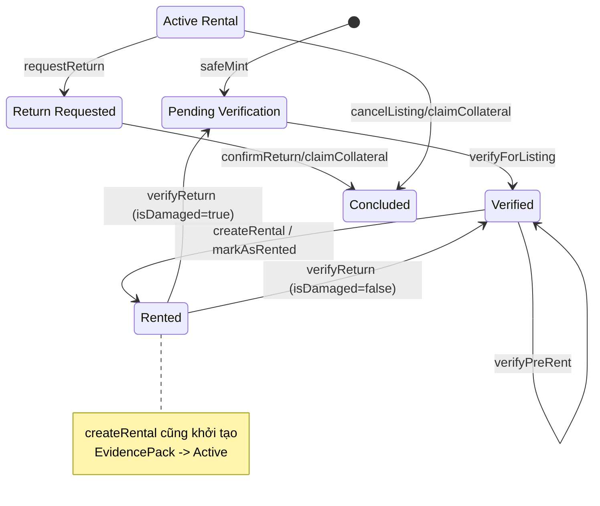

# Giải mã Logic Nghiệp vụ (Extracted Logic)

## 1. Phân tích Logic Hàm Cốt lõi

### `VinaLibVault.sol`
- **`createRental`**: Khởi tạo cho thuê. Kiểm tra sách đã được verify (staticcall qua BookAsset). Liên kết với SBT ID có sẵn. Đánh dấu sách trạng thái Rented. Cấp quyền User (ERC4907) tới hạn. Lưu EvidencePack trạng thái Active.
- **`requestReturn`**: Người thuê hoặc Admin yêu cầu trả sách. Cập nhật RentalStatus sang ReturnRequested và lưu deliveryHash.
- **`confirmReturn`**: Admin xác nhận trả sách thành công. Xóa quyền User trên BookAsset. Gọi `verifyReturn` để cập nhật trạng thái BookAsset (thành Verified hoặc PendingVerification nếu hư hại). Chuyển RentalStatus sang Concluded.
- **`cancelListing`**: Hủy thuê khi đang giao dịch. Xóa quyền User, gọi `verifyReturn` và chuyển trạng thái sang Concluded.
- **`claimCollateral`**: Xử lý vi phạm/tranh chấp. Xóa quyền User, đánh dấu sách damaged (`verifyReturn`), và chuyển trạng thái sang Concluded.

### `BookAsset.sol`
- **`safeMint`**: Mint sách mới. Mặc định vào trạng thái `PendingVerification`.
- **`verifyForListing`**: Admin verify sách mới để sẵn sàng list. Trạng thái chuyển sang `Verified`.
- **`verifyPreRent`**: Kiểm tra lại trước khi cho thuê, cập nhật timestamp xác nhận.
- **`markAsRented`**: Chuyển trạng thái từ `Verified` sang `Rented`.
- **`verifyReturn`**: Cập nhật trạng thái sách thành `PendingVerification` (nếu hư hại) hoặc `Verified` (nếu nguyên vẹn).

## 2. Ma Trận Ràng Buộc (Require / Revert)

| Contract | Hàm | Ràng buộc chính | Revert Message |
|----------|-----|-----------------|----------------|
| VinaLibVault | createRental | Sách phải được Admin verify (`isVerified`) | `Book not verified by Admin` |
| VinaLibVault | requestReturn | Rental status phải là Active | `No active rental to return` |
| VinaLibVault | requestReturn | Caller là renter hoặc admin | `Not Authorized` |
| VinaLibVault | confirmReturn | Rental status là ReturnRequested hoặc Active | `Invalid status` |
| VinaLibVault | cancelListing | Rental status là Active | `Can only cancel active rentals` |
| VinaLibVault | claimCollateral | Rental status là Active hoặc ReturnRequested | `No active rental to claim` |
| BookAsset | verifyForListing | Sách đang PendingVerification | `Not pending verification` |
| BookAsset | verifyPreRent | Sách đang Verified | `Book not verified` |
| BookAsset | markAsRented | Sách đang Verified | `Book not verified for rent` |
| BookAsset | verifyReturn | Sách đang Rented | `Book not rented` |
| RentalAgreementSBT | \_update | Chặn Transfer ngang hàng SBT | `SBT: Token is Soulbound and cannot be transferred` |

## 3. Mô tả Dòng luân chuyển Trạng thái / Quyền

Dự án hiện tại tập trung quản lý bảo chứng NFT và quyền thuê (không có dòng tiền Native/ERC20 trực tiếp trong `VinaLibVault`):
- **Cấp quyền sử dụng**: Khi `createRental`, Validator gọi `bookAssetAddress.call("setUser", user, expires)` cấp quyền thuê cho User (chuẩn ERC4907).
- **Thu hồi quyền sử dụng**: Khi `confirmReturn`, `cancelListing` hoặc `claimCollateral`, Vault gọi `setUser` với tham số `address(0)` và expires = 0 để tước quyền ngay lập tức.
- **SBT Binding**: Bằng chứng thuê sách trên chuỗi không tự tạo SBT, mà mapping sang ID của `RentalAgreementSBT` đã được pre-mint từ Backend.
- **Dòng luân chuyển chứng cứ**: Mỗi phiên thuê lưu 1 `EvidencePack` bao gồm `termsHash`, `version`, `pspRef`, và `deliveryHash`.

## 4. State Machine Diagram (FSM)

