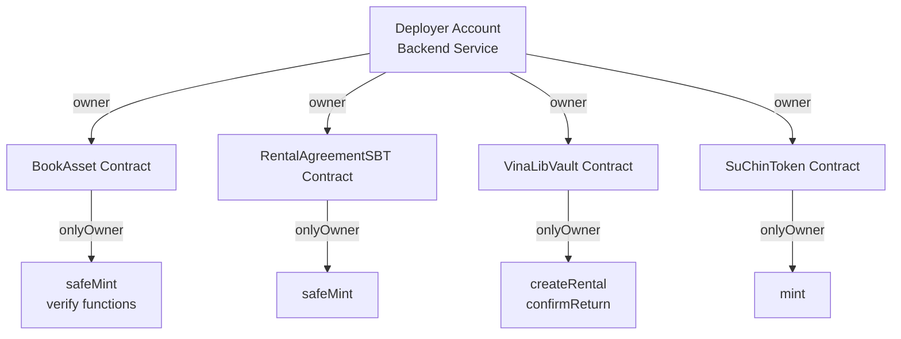

# BÁO CÁO TIỀN KHẢ THI: TÍCH HỢP VINALIB LÊN NDACHAIN L2

**Date**: 2026-01-17  
**Version**: 1.1  
**Purpose**: Đánh giá khả thi và cung cấp roadmap chi tiết về **CÁCH THỨC** tích hợp VinaLib lên NDAChain L2. Đã cập nhật trạng thái Phase 1.5 (Payment System).

> [!NOTE]
> **STATUS: FUTURE ROADMAP - PHASE 3+**
> 
> Tài liệu này mô tả **khả năng tích hợp tương lai** với NDAChain L2 và hệ thống DID/VC (Decentralized Identity / Verifiable Credentials). 
> 
> **Định vị hiện tại của dự án**:
> - **Phase 1 (Current)**: Tập trung vào Ethereum-compatible blockchain core
>   - Smart Contracts (ERC-721, ERC-4907, Soulbound Token)
>   - IPFS Simulator
>   - Mock Services (FPT Legal, Tuya IoT, Bank)
>   - Testing Interface (Backend/Frontend minimalist)
> 
> - **Phase 2 (Next)**: UI/UX Integration khi team design hoàn thành
> 
> - **Phase 3+ (Future)**: L2 Integration với NDAChain/DID system
>   - Yêu cầu: Phase 1 và 2 hoàn thành, NDAChain L2 production-ready
>   - Timeline: Chưa xác định
> 
> Việc tích hợp L2/DID sẽ được **tái đánh giá** sau khi:
> 1. ✅ Smart Contracts đã audit và stable (≥90% test coverage)
> 2. ✅ Phase 2 UI/UX hoàn thành
> 3. ✅ NDAChain L2 team cung cấp API specifications và testnet access
> 
> **Tham khảo**: Xem `kiến trúc/cấu trúc quy luật tối cao/QUY_LUAT_TOI_CAO.md` Section 0 để hiểu rõ phân giai đoạn phát triển hiện tại.

---

## 📋 TÓM TẮT ĐIỀU HÀNH

### Kết Luận Tổng Quát
✅ **KHẢ THI** - VinaLib có thể tích hợp lên NDAChain L2 với **85% mức độ tương thích** hiện tại.

### Lợi Ích Chính
1. **Định danh hợp pháp**: Sử dụng DID quốc gia thay vì Ethereum addresses
2. **Tuân thủ pháp luật**: Phù hợp với yêu cầu KYC/AML Việt Nam
3. **Bảo mật nâng cao**: Verifiable Credentials thay vì public addresses
4. **Khả năng mở rộng**: Tương thích 100M+ công dân Việt Nam

### Thời Gian Dự Kiến
**13 tuần (3 tháng)** - Tuần 1-3: Contracts | Tuần 4-6: Backend | Tuần 7-9: Frontend| Tuần 10-12: Testing | Tuần 13: Deployment

### Tiền Đề Quan Trọng
🔴 **CRITICAL**: NDAChain L1 team cần cung cấp:
- API specification (REST endpoints)
- Smart contract addresses (DID Registry, VC Verifier)
- Wallet extension hoặc SDK
- Testnet access credentials

---

## 💎 CƠ CHẾ TOKEN HIỆN TẠI - BASELINE TRƯỚC KHI MIGRATE

### Tổng Quan Token Architecture

VinaLib sử dụng **3 loại token tiêu chuẩn** để quản lý tài sản, quyền sử dụng, và bằng chứng hợp đồng:

| Token Type | Standard | Mục Đích | Người Sở Hữu | Transferable |
|------------|----------|----------|--------------|--------------|
| **BookAsset** | ERC-721 + ERC-4907 | Đại diện tài sản sách | Lender (Owner) + Renter (User) | ✅ Owner, ❌ User |
| **RentalAgreementSBT** | ERC-721 (Soulbound) | Bằng chứng hợp đồng thuê | Renter | ❌ Soulbound |
| **SuChinToken** | ERC-20 | Utility token (traceability) | Various holders | ✅ Yes |

---

### 1. Cơ Chế Tạo Token (Minting Mechanism)

#### 1.1. BookAsset NFT (ERC-721 + ERC-4907)

**Trigger Flow**:
```
Lender upload sách → Backend tạo IPFS metadata → Admin verify → 
Backend gọi BookAsset.safeMint() → NFT được mint cho Lender
```

**Smart Contract Code**:
```solidity
// File: BookAsset.sol
function safeMint(address to, string memory cid) public onlyOwner {
    uint256 tokenId = _nextTokenId++;
    _safeMint(to, tokenId);            // Mint NFT cho Lender
    tokenCIDs[tokenId] = cid;          // Lưu IPFS CID
    bookStatuses[tokenId] = BookStatus.PendingVerification;
}
```

**Ownership Model**:
- **Token Owner (Lender)**: Quyền sở hữu vĩnh viễn, có thể transfer NFT
- **Token User (Renter)**: Quyền sử dụng tạm thời (set bởi `VinaLibVault.createRental()`), KHÔNG thể transfer

**Người Chi Trả Gas**: 🏢 **Admin/Hệ thống** (Backend account gọi `onlyOwner` function)

---

#### 1.2. RentalAgreementSBT (Soulbound Token)

**Trigger Flow**:
```
User thanh toán → Admin approve → Backend gọi VinaLibVault.createRental() → 
Tự động gọi RentalAgreementSBT.safeMint() → SBT mint cho Renter
```

**Smart Contract Code**:
```solidity
// File: RentalAgreementSBT.sol
function safeMint(address to, bytes32 termsHash) public onlyOwner {
    uint256 tokenId = _nextTokenId++;
    _safeMint(to, tokenId);
    rentalTerms[tokenId] = termsHash;  // Hash điều khoản hợp đồng
}

// Chặn chuyển nhượng (Soulbound Logic)
function _update(address to, uint256 tokenId, address auth) 
    internal virtual override returns (address) 
{
    address from = _ownerOf(tokenId);
    if (from != address(0) && to != address(0)) {
        revert("SBT: Token is Soulbound and cannot be transferred");
    }
    return super._update(to, tokenId, auth);
}
```

**Ownership Model**:
- **Token Owner (Renter)**: Gắn chặt với ví, KHÔNG thể chuyển nhượng
- **Purpose**: Chứng chỉ kỹ thuật số chứng minh đã ký hợp đồng thuê

**Người Chi Trả Gas**: 🏢 **Admin/Hệ thống** (auto-mint trong `createRental()`)

---

#### 1.3. SuChinToken (ERC-20 Utility Token)

**Initial Supply**:
```solidity
// File: SuChinToken.sol
constructor() ERC20("SuChin Token", "SUC") Ownable(msg.sender) {
    _mint(msg.sender, 1000000 * 10 ** decimals()); // 1M SUC cho deployer
}

function mint(address to, uint256 amount) public onlyOwner {
    _mint(to, amount); // Dev/Test only
}
```

**Mục Đích**:
- ✅ Traceability: Ghi nhận giao dịch on-chain
- ❌ KHÔNG lưu giá trị tiền cọc thực (tuân thủ pháp luật VN)
- 📝 Thanh toán thực tế xử lý off-chain qua Banking APIs

**Người Chi Trả Gas**:
- 🏢 **Deployer** (one-time deployment)
- 🏢 **Admin** (mint thêm token cho test users)

---

### 2. Mô Hình Quyền Sở Hữu (Ownership Hierarchy)

#### 2.1. Contract-Level Ownership



**Quyền Hạn `onlyOwner`**:
- Mint tất cả loại token
- Verify book listing/rental
- Execute rental lifecycle (create, confirm return)
- Pause/unpause contracts (emergency)

---

#### 2.2. Asset-Level Ownership

**BookAsset NFT**:
```
Contract Owner (Admin/Backend)
  ├─ Quyền: Mint, Verify, Pause
  │
  └─ Token #1234
      ├─ Owner: 0xLender123... (Lender Account)
      │   └─ Quyền: Transfer NFT, Burn, Approve
      │
      └─ User: 0xRenter456... (Renter Account)
          └─ Quyền: Sử dụng sách đến expires timestamp
          └─ KHÔNG có quyền: Transfer, Burn
```

**RentalAgreementSBT**:
```
Contract Owner (Admin/Backend)
  ├─ Quyền: Mint SBT
  │
  └─ Token #5678
      └─ Owner: 0xRenter456... (Renter Account)
          └─ Quyền: KHÔNG thể transfer (Soulbound)
          └─ Chức năng: Proof of rental agreement
```

---

### 3. Mô Hình Thanh Toán Gas Fee

#### 3.1. Phân Bổ Chi Phí (Current Implementation)

| Giao Dịch | Người Gọi TX | Người Trả Gas | Frequency | Estimated Gas |
|-----------|-------------|---------------|-----------|---------------|
| **Deploy Contracts** | Backend (Deployer) | 🏢 Admin | One-time | ~8,800,000 |
| **Mint BookAsset** | Backend | 🏢 Admin | Per book upload | ~150,000 |
| **Verify Listing** | Backend | 🏢 Admin | Per verification | ~50,000 |
| **Create Rental** | Backend | 🏢 Admin | Per rental start | ~250,000 |
| **Mint RentalSBT** | Auto (in createRental) | 🏢 Admin | Auto-triggered | Included above |
| **Set User (ERC-4907)** | Auto (in createRental) | 🏢 Admin | Auto-triggered | Included above |
| **Request Return** | Renter hoặc Backend | 👤 User hoặc 🏢 Admin | Per return | ~80,000 |
| **Confirm Return** | Backend | 🏢 Admin | Per return | ~100,000 |

**Mô Hình Hiện Tại**: **Admin-Subsidized (Trusted Backend)**
- 🏢 Admin/Hệ thống chi trả **~90% gas fees**
- 👤 User chỉ trả gas nếu chủ động gọi `requestReturn()` (optional)
- 💡 Lý do: Đơn giản hóa UX, phù hợp với MVP trusted model

---

#### 3.2. Ước Tính Chi Phí (Ethereum Mainnet vs L2)

**Deployment Cost (One-time)**:
```
Ethereum Mainnet (10 gwei gas price):
  - Total gas: ~8,800,000
  - ETH cost: ~0.088 ETH
  - USD cost: ~$330 @ $3,800/ETH

NDAChain L2 (predicted):
  - Gas reduction: 100-1000x
  - USD cost: ~$0.33 - $3.30
```

**Per Rental Cycle Cost**:
```
Ethereum Mainnet:
  1. Mint BookAsset: ~150,000 gas
  2. Verify Listing: ~50,000 gas
  3. Create Rental: ~250,000 gas
     ├─ Mint SBT: included
     ├─ Set User: included
     └─ Store EvidencePack: included
  4. Confirm Return: ~100,000 gas
  Total: ~550,000 gas (~$21 @ 10 gwei, $3,800/ETH)

NDAChain L2 (predicted):
  - Same operations: ~550,000 gas
  - USD cost: ~$0.02 - $0.21 (100-1000x cheaper)
```

---

#### 3.3. Tác Động Khi Migrate Lên L2

**✅ Lợi Ích Chi Phí**:
1. **Giảm 100-1000x gas cost**: Rental cycle từ $21 → $0.02-$0.21
2. **Scalability**: Có thể xử lý nhiều giao dịch hơn với budget cố định
3. **Admin burden giảm**: Chi phí vận hành hệ thống giảm đáng kể

**⚠️ Ownership Model KHÔNG Đổi**:
- Admin vẫn sở hữu contracts
- Lender vẫn sở hữu BookAsset NFTs
- Renter vẫn nhận Soulbound Tokens
- Gas payment model có thể duy trì Admin-Subsidized

**🔄 Gas Payment Options Trên L2**:

| Option | Description | User Experience | Admin Cost |
|--------|-------------|-----------------|------------|
| **Admin-Subsidized** (Current) | Admin trả 100% gas | User KHÔNG cần native token | Cao (nhưng rẻ hơn L1) |
| **Meta-Transactions** | Admin relay, user ký message | User KHÔNG cần gas | Trung bình |
| **Gasless (GSN/Biconomy)** | Third-party relayer | User KHÔNG cần gas | Thấp (fee relayer) |
| **Hybrid** | User có thể chọn tự trả | User CÓ THỂ tự trả | Thấp |

**📌 Khuyến Nghị**: Tiếp tục **Admin-Subsidized** hoặc chuyển sang **Meta-Transactions** để giữ UX đơn giản, tận dụng gas cost thấp trên L2.

---

## 🎯 PHẦN I: LÀM SAO ĐỂ TÍCH HỢP - ROADMAP CHI TIẾT


### Bước 1: Hiểu Kiến Trúc Hiện Tại (VinaLib)

#### 1.1. Core VinaLib Components

**Smart Contracts** (Solidity 0.8.20):
```
BookAsset.sol        → ERC-721 + ERC-4907 (Rentable NFT)
RentalAgreementSBT.sol → Soulbound Token (không chuyển nhượng)
VinaLibVault.sol     → Evidence Pack Ledger (lưu termsHash, pspRef)
```

**Backend** (Express.js - VSA):
```
8 Modules: Identity, Rental, Book, Payment, IoT, Admin, IPFS, Legal
- In-memory storage(restart = data loss)
- Header-based auth (x-user-id) - NO JWT
- Orchestration layer cho blockchain calls
```

**Frontend** (React 19 - FSD):
```
8 Pages: login, register, home, account, wallet, admin, lender-manage, rent-out
- MetaMask connection (window.ethereum)
- Basic UI (không polished)
```

**Authentication Hiện Tại**:
```javascript
// User identified by Ethereum address
const userAddress = "0x1234...5678";
await vaultContract.createRental(userAddress, ...);
```

#### 1.2. NDAChain L1 Architecture (Hybrid DID)

**Blockchain Layer**:
```
- PoA Consensus (1200 TPS, 2s latency)
- Permissioned: Government validators
- Smart Contracts: DID Registry, VC Verifier
```

**DID Structure**:
```json
{
  "id": "did:nda:vietnam:8279123456789012",
  "verificationMethod": [{
    "type": "EcdsaSecp256k1VerificationKey2019",
    "blockchainAccountId": "eip155:1:0xb9c5714089478a327..."
  }]
}
```

**Verifiable Credentials**:
```json
{
  "type": ["VerifiableCredential", "CitizenshipCredential"],
  "issuer": "did:nda:gov:ministry-of-public-security",
  "credentialSubject": {
    "id": "did:nda:vietnam:8279123456789012",
    "citizenship": "VN",
    "birthDate": "1990-01-01"
  }
}
```

**Authentication Mới**:
```javascript
// User identified by DID + VC proof
const userDID = "did:nda:vietnam:8279123456789012";
const vcProof = {...}; // Verifiable Credential
await vaultContract.createRentalWithDID(userDID, vcProof, ...);
```

---

### Bước 2: Xác Định Điểm Tích Hợp (Integration Points)

#### 2.1. Ma Trận Tích Hợp

| Layer | Component | Current | After Integration | Change Level |
|-------|-----------|---------|-------------------|--------------|
| **L1** | Authentication | MetaMask (address) | NDAChain Wallet (DID) | 🔴 Major |
| **L2 Smart Contracts** | createRental() | address user | string userDID + bytes vcProof | 🟡 Medium |
| **L2 Backend** | Auth middleware | x-user-id header | did + vc-proof headers | 🟡 Medium |
| **L2 Frontend** | Wallet connect | window.ethereum | window.ndachain | 🟡 Medium |
| **Data Model** | EvidencePack | address user | string userDID + address (mapped) | 🟡 Medium |

#### 2.2. Kênh Kết Nối Cần Thiết

**Kênh CN-1: Frontend ↔ L1 Wallet Extension**
- Protocol: JavaScript Bridge (in-browser)
- Function: `window.ndachain.requestDID()`, `requestCredential()`
- Latency: ~0ms (local)

**Kênh CN-2: Backend ↔ L1 API Server**
- Protocol: HTTPS/JSON (RESTful)
- Endpoints: `/did/verify`, `/vc/verify`
- Latency: ~100-500ms

**Kênh CN-3: L2 Contracts ↔ L1 DID Registry**
- Protocol: Contract-to-Contract Call (on-chain)
- Function: `resolveDID(string did) returns (bool, address)`
- Gas Cost: ~2000 (view function)

**Kênh CN-4: L2 Contracts ↔ L1 VC Verifier**
- Protocol: Contract-to-Contract Call
- Function: `verifyCredential(bytes vcProof, string claim) returns (bool)`
- Gas Cost: ~5000

---

### Bước 3: Implementation Roadmap (13 Tuần)

#### PHASE 1: Smart Contract Integration (Tuần 1-3)

**Objective**: Thêm DID authentication layer vào contracts hiện tại

**3.1. Tạo L1 Integration Layer**

Tạo file mới: `contracts/L1Integration.sol`

```solidity
// SPDX-License-Identifier: MIT
pragma solidity ^0.8.20;

interface IL1DIDRegistry {
    function resolveDID(string memory did) 
        external view returns (bool exists, address owner);
}

interface IL1VCVerifier {
    function verifyCredential(bytes memory vcProof, string memory claim) 
        external view returns (bool);
}

contract L1Integration {
    IL1DIDRegistry public didRegistry;
    IL1VCVerifier public vcVerifier;
    
    // Cache để giảm gas cost
    mapping(string => CachedDIDInfo) public didCache;
    
    struct CachedDIDInfo {
        address owner;
        uint256 timestamp;
        bool verified;
    }
    
    constructor(address _didRegistry, address _vcVerifier) {
        didRegistry = IL1DIDRegistry(_didRegistry);
        vcVerifier = IL1VCVerifier(_vcVerifier);
    }
    
    function verifyUserDID(string memory did, bytes memory vcProof) 
        internal returns (address) 
    {
        // 1. Check cache (1 hour TTL)
        if (didCache[did].timestamp + 3600 > block.timestamp) {
            require(didCache[did].verified, "Cached DID invalid");
            return didCache[did].owner;
        }
        
        // 2. Call L1 DID Registry
        (bool exists, address owner) = didRegistry.resolveDID(did);
        require(exists, "DID not found on L1");
        
        // 3. Verify citizenship VC
        require(
            vcVerifier.verifyCredential(vcProof, "citizenship"),
            "Invalid citizenship credential"
        );
        
        // 4. Update cache
        didCache[did] = CachedDIDInfo({
            owner: owner,
            timestamp: block.timestamp,
            verified: true
        });
        
        return owner;
    }
}
```

**3.2. Update VinaLibVault.sol**

```solidity
import "./L1Integration.sol";

contract VinaLibVault is L1Integration, FunctionsClient, Ownable {
    
    // NEW: Enhanced EvidencePack với DID
    struct EvidencePackV2 {
        string userDID;         // Primary identifier
        address userAddress;    // Derived from DID (backward compat)
        uint256 rentalTokenId;
        uint256 bookTokenId;
        bytes32 termsHash;
        bytes32 vcHash;         // Hash of VC claims
        bytes32 deliveryHash;
        uint64 timestamp;
        uint16 version;         // 1 = address-based, 2 = DID-based
        string pspRef;
    }
    
    // Bi-directional mapping
    mapping(string => address) public didToAddress;
    mapping(address => string) public addressToDID;
    
    // NEW: DID-based rental creation
    function createRentalWithDID(
        string memory userDID,
        bytes memory vcProof,
        uint256 bookTokenId,
        uint64 duration,
        bytes32 termsHash,
        uint16 version,
        string memory pspRef
    ) external onlyOwner {
        // 1. Verify DID and get address (từ L1Integration)
        address userAddr = verifyUserDID(userDID, vcProof);
        
        // 2. Store bidirectional mapping
        didToAddress[userDID] = userAddr;
        addressToDID[userAddr] = userDID;
        
        // 3. Continue with existing rental logic (80% reuse)
        _createRentalInternal(
            userAddr,
            userDID,
            bookTokenId,
            duration,
            termsHash,
            keccak256(vcProof), // vcHash
            version,
            pspRef
        );
    }
    
    // Extract existing logic to internal function
    function _createRentalInternal(
        address userAddr,
        string memory userDID,
        uint256 bookTokenId,
        uint64 duration,
        bytes32 termsHash,
        bytes32 vcHash,
        uint16 version,
        string memory pspRef
    ) internal {
        // [Giữ NGUYÊN logic hiện tại]
        // - Check isVerified (BookAsset)
        // - Mint SBT (RentalAgreementSBT)
        // - SetUser (BookAsset.setUser)
        // - Store EvidencePackV2
    }
    
    // Backward compatibility: Old function still works
    function createRental(...) external onlyOwner {
        // Call _createRentalInternal with empty DID
        _createRentalInternal(user, "", bookTokenId, ...);
    }
}
```

**Deliverables**:
- [ ] `L1Integration.sol` created & tested
- [ ] `VinaLibVault.sol` updated với DID functions
- [ ] Unit tests với mock L1 contracts (coverage > 90%)
- [ ] Gas optimization analysis
- [ ] Deploy to local Hardhat network

---

#### PHASE 2: Backend API Integration (Tuần 4-6)

**Objective**: Thêm DID authentication middleware và L1 API client

**4.1. Tạo L1 API Client**

File mới: `backend/src/Shared/l1-client.js`

```javascript
const axios = require('axios');

class NDAChainL1Client {
    constructor() {
        this.baseUrl = process.env.L1_API_URL || 'https://api.ndachain.gov.vn/v1';
    }
    
    /**
     * Verify DID ownership with signature
     */
    async verifyDID(did, signature) {
        try {
            const response = await axios.post(
                `${this.baseUrl}/did/verify`,
                { did, signature },
                { timeout: 5000 }
            );
            return response.data; // { valid: true, address: "0x..." }
        } catch (error) {
            console.error('[L1Client] DID verification failed:', error.message);
            throw new Error('L1 DID verification failed');
        }
    }
    
    /**
     * Verify Verifiable Credential
     */
    async verifyVC(vcProof, requiredClaims = ['citizenship']) {
        try {
            const response = await axios.post(
                `${this.baseUrl}/vc/verify`,
                { proof: vcProof, claims: requiredClaims },
                { timeout: 5000 }
            );
            return response.data; // { valid: true, claims: {...} }
        } catch (error) {
            console.error('[L1Client] VC verification failed:', error.message);
            throw new Error('L1 VC verification failed');
        }
    }
    
    /**
     * Resolve DID to get DID Document
     */
    async resolveDID(did) {
        try {
            const response = await axios.get(`${this.baseUrl}/did/${did}`);
            return response.data; // DID Document
        } catch (error) {
            console.error('[L1Client] DID resolution failed:', error.message);
            return null;
        }
    }
}

module.exports = NDAChainL1Client;
```

**4.2. Tạo DID Authentication Middleware**

File mới: `backend/src/Shared/did-auth.js`

```javascript
const NDAChainL1Client = require('./l1-client');

const l1Client = new NDAChainL1Client();

/**
 * Middleware: Authenticate user with DID + VC
 * Headers: 'did' và 'vc-proof'
 */
async function authenticateDID(req, res, next) {
    const did = req.headers['did'];
    const vcProofStr = req.headers['vc-proof'];
    
    if (!did || !vcProofStr) {
        return res.status(401).json({ 
            error: 'Missing DID credentials',
            message: 'Headers "did" and "vc-proof" are required'
        });
    }
    
    try {
        const vcProof = JSON.parse(vcProofStr);
        
        // 1. Verify VC với L1
        const vcResult = await l1Client.verifyVC(
            vcProof,
            ['citizenship', 'age'] // Required claims
        );
        
        if (!vcResult.valid) {
            return res.status(401).json({ 
                error: 'Invalid credentials',
                message: 'VC verification failed'
            });
        }
        
        // 2. Attach user info to request
        req.user = {
            did: did,
            address: vcResult.address, // Derived từ DID
            claims: vcResult.claims
        };
        
        next();
    } catch (error) {
        console.error('[DIDAuth] Error:', error);
        res.status(500).json({ 
            error: 'L1 verification failed',
            details: error.message 
        });
    }
}

/**
 * Dual auth: Support both DID and legacy address
 */
async function authenticateDualMode(req, res, next) {
    // Try DID auth first
    if (req.headers.did && req.headers['vc-proof']) {
        return authenticateDID(req, res, next);
    }
    
    // Fallback to legacy address auth (deprecated)
    if (req.headers['x-user-id']) {
        console.warn('[DEPRECATED] Address-based auth, please migrate to DID');
        req.user = { address: req.headers['x-user-id'] };
        return next();
    }
    
    return res.status(401).json({ 
        error: 'No valid authentication',
        message: 'Provide either DID credentials or x-user-id header'
    });
}

module.exports = { authenticateDID, authenticateDualMode };
```

**4.3. Update Rental Controller**

Modify: `backend/src/modules/Rental/controller.js`

```javascript
const { authenticateDualMode } = require('../../Shared/did-auth');
const NDAChainL1Client = require('../../Shared/l1-client');

// Apply dual auth middleware
router.post('/api/booking', authenticateDualMode, async (req, res) => {
    const { did, address } = req.user; // From middleware
    const { bookId, duration } = req.body;
    
    // Create booking (support both DID and address)
    const booking = {
        bookingCode: generateCode(),
        bookId,
        duration,
        userDID: did || '',
        userAddress: address,
        status: 'PENDING_SIGN',
        createdAt: Date.now()
    };
    
    bookings.set(booking.bookingCode, booking);
    res.json({ success: true, booking });
});

// When finalizing rental (after payment)
async function finalizeRental(bookingCode) {
    const booking = bookings.get(bookingCode);
    const { userDID, userAddress, vcProof } = booking;
    
    if (userDID) {
        // Use NEW DID-based function
        const tx = await vaultContract.createRentalWithDID(
            userDID,
            vcProof,
            booking.bookId,
            booking.duration,
            booking.termsHash,
            2, // version = 2 (DID-based)
            booking.pspRef
        );
        await tx.wait();
    } else {
        // Use OLD address-based function (backward compat)
        const tx = await vaultContract.createRental(
            userAddress,
            booking.bookId,
            booking.termsHash,
            booking.pspRef
        );
        await tx.wait();
    }
}
```

**4.4. Update Environment Config**

Add to `.env`:
```bash
# NDAChain L1 Integration
L1_API_URL=https://api.ndachain.gov.vn/v1
L1_DID_REGISTRY_ADDRESS=0x... # From L1 team
L1_VC_VERIFIER_ADDRESS=0x...  # From L1 team
```

**Deliverables**:
- [ ] `l1-client.js` implemented & tested
- [ ] `did-auth.js` middleware tested
- [ ] Rental controller updated với dual auth
- [ ] Identity module updated (login with DID)
- [ ] Integration tests với mock L1 APIs
- [ ] Real L1 testnet testing

---

#### PHASE 3: Frontend UI Integration (Tuần 7-9)

**Objective**: Update UI để support NDAChain Wallet connection

**5.1. NDAChain Wallet Integration**

File mới: `frontend/src/shared/lib/ndachain-wallet.ts`

```typescript
interface NDAChainWallet {
    requestDID(): Promise<string>;
    requestCredential(claims: string[]): Promise<VCProof>;
    signMessage(message: string): Promise<string>;
}

interface VCProof {
    proof: any;
    claims: Record<string, any>;
    address: string;
}

declare global {
    interface Window {
        ndachain?: NDAChainWallet;
    }
}

export async function connectDIDWallet(): Promise<{
    did: string;
    vcProof: VCProof;
}> {
    if (!window.ndachain) {
        throw new Error('NDAChain Wallet not installed. Please install the extension.');
    }
    
    try {
        // 1. Request DID from wallet
        const did = await window.ndachain.requestDID();
        
        // 2. Request Verifiable Credential
        const vcProof = await window.ndachain.requestCredential([
            'citizenship',  // Citizenship proof
            'age'          // Age verification
        ]);
        
        return { did, vcProof };
    } catch (error: any) {
        throw new Error(`DID Wallet connection failed: ${error.message}`);
    }
}

// Fallback to MetaMask for development
export async function connectMetaMask(): Promise<{ address: string }> {
    if (!window.ethereum) {
        throw new Error('MetaMask not installed');
    }
    
    const accounts = await window.ethereum.request({
        method: 'eth_requestAccounts'
    });
    
    return { address: accounts[0] };
}
```

**5.2. Update Login Page**

Modify: `frontend/src/pages/login/ui/LoginPage.tsx`

```typescript
import { connectDIDWallet, connectMetaMask } from '../../../shared/lib/ndachain-wallet';
import axios from 'axios';

function LoginPage() {
    const [loading, setLoading] = useState(false);
    const [error, setError] = useState('');
    const navigate = useNavigate();
    
    // PRIMARY: Login with NDAChain DID
    const handleDIDLogin = async () => {
        setLoading(true);
        setError('');
        
        try {
            // 1. Connect to NDAChain Wallet
            const { did, vcProof } = await connectDIDWallet();
            
            // 2. Verify with backend
            const response = await axios.post(
                '/api/login-did',
                {},
                {
                    headers: {
                        'did': did,
                        'vc-proof': JSON.stringify(vcProof)
                    }
                }
            );
            
            // 3. Store credentials
            localStorage.setItem('userDID', did);
            localStorage.setItem('vcProof', JSON.stringify(vcProof));
            localStorage.setItem('userAddress', vcProof.address);
            localStorage.setItem('userName', vcProof.claims.legalName || 'User');
            
            // 4. Navigate to dashboard
            navigate('/dashboard');
        } catch (err: any) {
            setError(err.message);
        } finally {
            setLoading(false);
        }
    };
    
    // FALLBACK: Login with MetaMask (dev only)
    const handleMetaMaskLogin = async () => {
        setLoading(true);
        setError('');
        
        try {
            const { address } = await connectMetaMask();
            
            // Legacy login (deprecated)
            localStorage.setItem('userAddress', address);
            localStorage.setItem('userName', address.substring(0, 8) + '...');
            
            navigate('/dashboard');
        } catch (err: any) {
            setError(err.message);
        } finally {
            setLoading(false);
        }
    };
    
    return (
        <div className="login-page">
            <h1>Đăng nhập VinaLib</h1>
            
            {error && <div className="error">{error}</div>}
            
            {/* PRIMARY LOGIN */}
            <button 
                onClick={handleDIDLogin}
                disabled={loading}
                className="btn-primary"
            >
                🆔 Đăng nhập với Định danh Quốc gia (NDAChain)
            </button>
            
            {/* DEV FALLBACK */}
            <button 
                onClick={handleMetaMaskLogin}
                disabled={loading}
                className="btn-secondary"
                style={{ opacity: 0.6, fontSize: '0.9em' }}
            >
                [Dev Only] MetaMask
            </button>
            
            <p className="hint">
                Bạn cần cài đặt ví NDAChain để đăng nhập.
            </p>
        </div>
    );
}
```

**5.3. Update API Interceptor**

Update: `frontend/src/shared/lib/api.ts`

```typescript
import axios from 'axios';

const api = axios.create({
    baseURL: API_BASE_URL
});

// Add DID headers to all requests
api.interceptors.request.use(config => {
    const did = localStorage.getItem('userDID');
    const vcProof = localStorage.getItem('vcProof');
    const address = localStorage.getItem('userAddress'); // Fallback
    
    // Priority: DID authentication
    if (did && vcProof) {
        config.headers['did'] = did;
        config.headers['vc-proof'] = vcProof;
    } 
    // Fallback: Address authentication (deprecated)
    else if (address) {
        config.headers['x-user-id'] = address;
    }
    
    return config;
});

export default api;
```

**Deliverables**:
- [ ] `ndachain-wallet.ts` implemented
- [ ] LoginPage updated với DID flow
- [ ] API interceptors updated
- [ ] User profile display (show DID + name)
- [ ] Test với NDAChain wallet extension
- [ ] Fallback MetaMask still works

---

#### PHASE 4: Integration Testing (Tuần 10-12)

**Objective**: End-to-end testing của full integration

**6.1. Test Scenarios**

**Test 1: DID Wallet Connection**
```
Steps:
1. User clicks "Đăng nhập với Định danh Quốc gia"
2. NDAChain Wallet popup appears
3. User unlocks wallet với PIN/biometric
4. Wallet returns DID + VC
5. Frontend receives credentials
6. Backend verifies với L1 API
7. User redirected to dashboard

Expected: Login successful, user info displayed
```

**Test 2: Complete Rental Flow với DID**
```
Steps:
1. Login với DID (Test 1)
2. Browse books → Select book
3. Create booking
4. Sign contract (Mock Legal Service)
5. Pay with wallet
6. Backend calls createRentalWithDID()
7. Smart contract verifies DID với L1
8. SBT minted, setUser called
9. EvidencePack stored on-chain

Expected: Rental active, can unlock device
```

**Test 3: Return Flow với DID**
```
Steps:
1. User requests return
2. Backend calls requestReturn()
3. Admin confirms return
4. Backend calls confirmReturn()
5. setUser revoked
6. Status updated

Expected: Rental concluded, deposit refunded
```

**Test 4: Error Handling**
```
Scenarios:
- Wallet not installed → Show install guide
- Invalid VC → Show error message
- L1 API timeout → Retry logic
- Expired VC → Prompt renewal

Expected: Graceful error handling
```

**6.2. Performance Testing**

**Metrics to measure**:
- L1 API response time: Target < 500ms
- Smart contract gas cost: Compare with/without L1 calls
- End-to-end rental flow: Target < 10 seconds

**6.3. Security Audit**

**Checklist**:
- [ ] L1 contract addresses verified (không hardcode sai)
- [ ] VC proof validation secure (không bypass được)
- [ ] No private keys in frontend code
- [ ] API rate limiting enabled
- [ ] Error messages không leak sensitive info
- [ ] HTTPS enforced cho L1 API calls

**Deliverables**:
- [ ] Test scenarios documented
- [ ] Integration tests passing
- [ ] Performance benchmarks recorded
- [ ] Security audit completed
- [ ] Bug fixes implemented
- [ ] User acceptance testing (5-10 users)

---

#### PHASE 5: Deployment (Tuần 13)

**Objective**: Deploy integrated system to staging/production

**7.1. Deployment Checklist**

**Smart Contracts**:
- [ ] Deploy `L1Integration.sol` to mainnet
- [ ] Deploy updated `VinaLibVault.sol`
- [ ] Configure L1 contract addresses
- [ ] Verify contracts on block explorer
- [ ] Transfer ownership to multi-sig wallet

**Backend**:
- [ ] Update `.env` với production L1 API URLs
- [ ] Deploy to server (node thứ 3001)
- [ ] Configure CORS for frontend
- [ ] Setup monitoring (logs, errors)

**Frontend**:
- [ ] Build production bundle
- [ ] Deploy to hosting (port 3001)
- [ ] Update API_BASE_URL
- [ ] Test với production L1 wallet

**7.2. Smoke Testing**

**Critical paths to test**:
1. DID login works
2. Rental creation works
3. Return flow works
4. Admin functions work

**7.3. Gradual Rollout**

**Strategy**:
- Week 1: Internal testing (team only)
- Week 2: Beta users (10-20 người)
- Week 3: Public release (if stable)

**Monitoring**:
- Error rates
- L1 API success rates
- User feedback
- Performance metrics

**Deliverables**:
- [ ] All components deployed
- [ ] Smoke tests passed
- [ ] Monitoring setup
- [ ] User documentation updated
- [ ] Support channel ready

---

## 🔍 PHẦN II: PHÂN TÍCH CHI TIẾT

### 8. Phân Tích Tương Thích (Compatibility Analysis)

#### 8.1. Smart Contracts: 90% Compatible

**Strengths**:
- ✅ Solidity 0.8.20 compatible với L1
- ✅ Interface-based integration (clean separation)
- ✅ Core rental logic không thay đổi
- ✅ Ver sioning support (v1 address, v2 DID)

**Required Changes**:
- ⚠️ Add L1Integration contract
- ⚠️ Update EvidencePack struct
- ⚠️ Add DID caching mechanism

#### 8.2. Backend: 75% Compatible

**Strengths**:
- ✅ VSA structure dễ thêm L1 client vào `/Shared`
- ✅ Controller mỏng (dễ thêm middleware)
- ✅ In-memory storage (không cần migrate database)

**Required Changes**:
- ⚠️ New authentication middleware
- ⚠️ Dual auth support (DID + address)
- ⚠️ L1 API error handling

#### 8.3. Frontend: 70% Compatible

**Strengths**:
- ✅ FSD structure có `/shared` layer sẵn
- ✅ Axios interceptor dễ update
- ✅ Component-based (dễ swap wallet)

**Required Changes**:
- ⚠️ New wallet connector (`ndachain-wallet.ts`)
- ⚠️ Update UI hiển thị DID thay vì address
- ⚠️ LocalStorage keys mới (userDID, vcProof)

#### 8.4. Legal Compliance: 100% Compatible

**Strengths**:
- ✅ DID ENHANCES compliance (không break)
- ✅ Off-chain payment vẫn giữ nguyên
- ✅ Two-way confirmation không đổi
- ✅ Evidence Pack vẫn lưu hash

**Additional Benefits**:
- ✅ VC claims có thể thêm vào EvidencePack (optional)
- ✅ DID verification tăng tính pháp lý
- ✅ Tuân thủ KYC/AML tốt hơn

---

### 9. Rủi Ro và Giảm Thiểu (Risk Assessment)

#### 9.1. Rủi Ro Kỹ Thuật

| Risk | Probability | Impact | Mitigation |
|------|------------|--------|------------|
| **L1 API không sẵn sàng** | 🟡 Medium | 🔴 High | Build mock L1 APIs cho development |
| **Wallet extension chưa có** | 🟡 Medium | 🔴 High | Fallback QR code auth hoặc MetaMask |
| **L1 API breaking changes** | 🟡 Medium | 🟡 Medium | Version pinning API, backward compat |
| **Performance degradation** | 🟢 Low | 🟡 Medium | Caching DID results, batch calls |
| **Gas cost tăng** | 🟢 Low | 🟢 Low | Optimize với view functions, cache |

#### 9.2. Rủi Ro Phụ Thuộc

| Dependency | Risk Level | Mitigation |
|------------|-----------|------------|
| **L1 API Documentation** | 🔴 Critical | Contact NDAChain team ASAP, request specs |
| **L1 Testnet Access** | 🔴 Critical | Request credentials early (Week 0) |
| **Wallet Extension** | 🟡 High | Build QR code fallback, SDK option |
| **L1 SDK/Library** | 🟢 Low | Can build custom client nếu cần |

#### 9.3. Rủi Ro Tuân Thủ

| Risk | Probability | Impact | Mitigation |
|------|------------|--------|------------|
| **Vi phạm QUY_LUAT** | 🟢 Low | 🔴 High | Code review checklist theo Section 6 |
| **Legal compliance issue** | 🟢 Low | 🔴 High | Không thay đổi payment/evidence flow |
| **Privacy regulations** | 🟢 Low | 🟡 Medium | Chỉ lưu hash, không lưu PII on-chain |

---

### 10. Tiền Đề và Yêu Cầu (Prerequisites)

#### 10.1. Từ NDAChain L1 Team (Week 0 - CRITICAL)

**Documentation**:
- [ ] L1 API specification document
  - REST endpoint specs (`/did/verify`, `/vc/verify`, etc.)
  - Request/response formats
  - Error codes và handling
  - Rate limiting policies

**Infrastructure**:
- [ ] Smart contract addresses (testnet)
  - DID Registry address
  - VC Verifier address
  - Contract ABIs

**Access**:
- [ ] Wallet extension download link hoặc SDK
- [ ] Testnet faucet access (để test)
- [ ] Testnet RPC endpoint URLs
- [ ] API credentials (nếu cần authentication)

**Support**:
- [ ] Integration guide/documentation
- [ ] Technical support channel (Slack/Discord)
- [ ] SLA for API availability

#### 10.2. Từ VinaLib Team (Week 0)

**Review**:
- [ ] Review `QUY_LUAT_TOI_CAO.md` compliance
- [ ] Review `hợp_đồng.md` legal implications
- [ ] Architect cận approval của integration plan

**Resources**:
- [ ] Allocate 2-3 developers (contract, backend, frontend)
- [ ] Allocate 1 QA engineer (testing)
- [ ] Allocate 0.5 DevOps (deployment)

**Environment**:
- [ ] Code freeze current features (stability)
- [ ] Setup development branch `feature/l2-integration`
- [ ] Prepare staging environment

---

## 📊 PHẦN III: KẾT LUẬN VÀ KHUYẾN NGHỊ

### 11. Kết Luận Tổng Thể

#### 11.1. Tính Khả Thi: ✅ KHẢ THI

**Compatibility Score**: **85%** (Highly Compatible)

**Breakdown**:
- Architecture: 85% - L2 app model phù hợp với L1 infrastructure
- Smart Contracts: 90% - Chỉ cần interface layer
- Backend: 75% - Auth middleware và L1 client
- Frontend: 70% - Wallet integration changes
- Data Model: 80% - Can extend với backward compatibility
- Legal: 100% - DID enhances compliance
- Security: 95% - DID/VC an toàn hơn addresses

#### 11.2. Lợi Ích Chính

1. **Tính Hợp Pháp**: Sử dụng định danh quốc gia (DID) thay vì crypto addresses
2. **Tuân Thủ**: Phù hợp KYC/AML requirements của Việt Nam
3. **Bảo Mật**: Verifiable Credentials thay vì public blockchain addresses
4. **Khả Năng Mở Rộng**: Tương thích 100M+ công dân
5. **Interoperability**: Tương thích các L2 apps khác trên NDAChain
6. **Không Phá Vỡ**: 80% logic hiện tại được tái sử dụng

#### 11.3. Thời Gian và Nguồn Lực

**Timeline**: 13 tuần (3 tháng)
- Phase 1: Smart Contracts (3 weeks)
- Phase 2: Backend (3 weeks)
- Phase 3: Frontend (3 weeks)
- Phase 4: Testing (3 weeks)
- Phase 5: Deployment (1 week)

**Team Size**: 3-4 người
- 1 Smart Contract Developer (full-time)
- 1 Full-stack Developer (backend + frontend)
- 1 QA Engineer (testing)
- 0.5 DevOps (deployment support)

**Effort**: ~9 person-weeks (trong 13 weeks calendar time)

---

### 12. Khuyến Nghị Hành Động

#### 12.1. Immediate Actions (Tuần Này)

**1. Contact NDAChain L1 Team**
- ✅ Request API specification document
- ✅ Request testnet credentials
- ✅ Schedule kickoff meeting
- ✅ Join integration support channel (Slack/Discord)

**2. Internal Preparation**
- ✅ Review `QUY_LUAT_TOI_CAO.md` compliance checklist
- ✅ Allocate dev resources (2-3 developers)
- ✅ Setup integration branch `feature/l2-integration`
- ✅ Create project timeline (Gantt chart)

#### 12.2. Short Term (Tháng 1)

**3. Prototype L1 Client**
- Build mock L1 APIs locally (Express server)
- Implement basic DID auth flow trong backend
- Test với fake DID data

**4. Smart Contract POC**
- Create `L1Integration.sol` prototype
- Test với mock L1 contracts (Hardhat)
- Validate gas costs (estimate)

#### 12.3. Medium Term (Tháng 2-3)

**5. Full Integration**
- Connect to real L1 testnet
- Complete backend + frontend integration
- Integration testing end-to-end

**6. Staging Deployment**
- Deploy to staging environment
- User acceptance testing (5-10 users)
- Performance optimization
- Bug fixes

---

### 13. Success Criteria

Để coi integration là thành công, cần đạt được:

**Technical Criteria**:
- [ ] 100% test coverage for L1 integration code
- [ ] < 500ms L1 API response time (P95)
- [ ] < 10s end-to-end rental flow (DID auth included)
- [ ] Zero security vulnerabilities (audit passed)

**Functional Criteria**:
- [ ] DID login works 99% của cases
- [ ] Rental creation với DID works
- [ ] Return flow với DID works
- [ ] Backward compatibility: Address-based auth vẫn works

**User Experience Criteria**:
- [ ] Wallet connection < 5 seconds
- [ ] Error messages clear và actionable
- [ ] No confusing UX cho users

**Business Criteria**:
- [ ] Tuân thủ 100% pháp luật Việt Nam
- [ ] KYC/AML compliance improved
- [ ] Can scale to 100M+ users
- [ ] Integration cost < 3 person-months

---

## 📚 PHỤ LỤC

### A. Tài Liệu Tham Khảo

**VinaLib Documentation**:
- `ĐỊNH_VỊ_DỰ_ÁN.md` - Project positioning
- `MÔ_TẢ_PHÂN_CẤP.md` - System architecture
- `SYSTEM_DESCRIPTION.json` - Component details
- `hợp_đồng.md` - Legal compliance
- `QUY_LUAT_TOI_CAO.md` - Architectural rules
- `BÁO_CÁO_TÍCH_HỢP_L2.md` - Previous integration analysis

**NDAChain Documentation**:
- `NDAChain-Whitepaper-VIE.md` - Full whitepaper
  - Chapter 3: Hybrid DID solution
  - Chapter 4: Technical architecture
  - Chapter 4.2: DID/VC structure
  - Chapter 4.5: DID Smart Contracts
  - Chapter 4.6: Zero-Knowledge Proofs (future)
  - Chapter 4.7: DIDComm v2 protocol (future)

### B. Glossary

- **DID**: Decentralized Identifier (Định danh Phi tập trung)
- **VC**: Verifiable Credential (Chứng chỉ Có thể Xác minh)
- **PoA**: Proof of Authority (Bằng chứng Quyền hạn)
- **ZKP**: Zero-Knowledge Proof (Bằng chứng Không tri thức)
- **L1**: Layer 1 (NDAChain infrastructure)
- **L2**: Layer 2 (VinaLib application)
- **VSA**: Vertical Slice Architecture (Backend)
- **FSD**: Feature-Sliced Design (Frontend)
- **SBT**: Soulbound Token (Token không chuyển nhượng)

### C. Contact Information

**For NDAChain L1 Integration Support**:
- Technical Support: [email/channel TBD]
- Documentation: [URL TBD]
- Testnet Faucet: [URL TBD]

**For VinaLib Team**:
- Project Lead: [TBD]
- Technical Architect: [TBD]
- Integration Developer: [TBD]

---

**Document Version**: 1.0  
**Prepared By**: Development Team  
**Date**: 2026-01-06  
**Next Review**: After L1 specs received from NDAChain team
