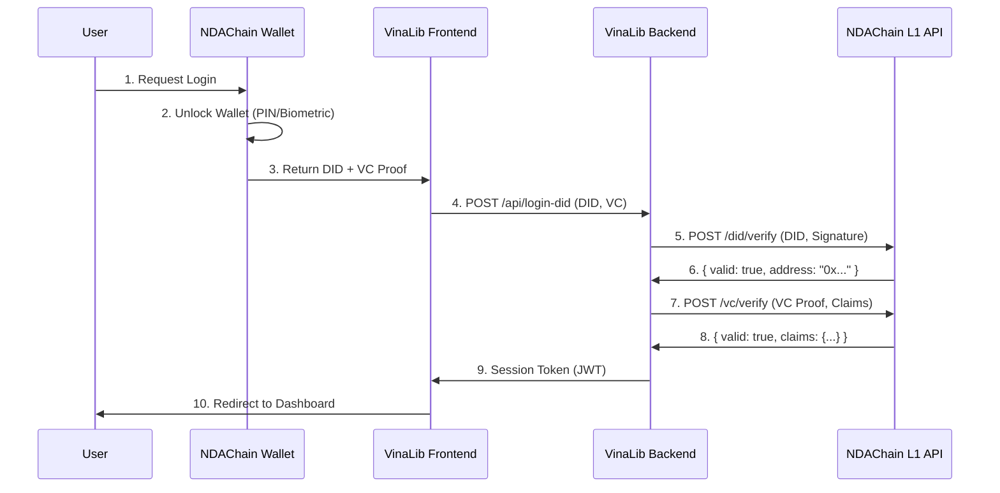

# BÁO CÁO: TÍCH HỢP VINALIB LÊN NDACHAIN L2

**Date**: 2026-01-06  
**Version**: 1.0  
**Status**: Integration Readiness Assessment

---

## 📋 TÓM TẮT ĐIỀU HÀNH (EXECUTIVE SUMMARY)

### Mục Tiêu
Tích hợp VinaLib-Vault (hệ thống cho thuê sách P2P) lên NDAChain L2 để sử dụng **hạ tầng định danh quốc gia (DID/VC)** thay vì authentication dựa trên Ethereum address.

### Kết Luận Chính
- **Tính khả thi**: ✅ **KHẢ THI** với điều kiện NDAChain L1 cung cấp APIs đầy đủ
- **Thời gian dự kiến**: 2-3 tháng development + integration testing
- **Mức độ thay đổi**: **Medium** - Không cần refactor toàn bộ, chỉ thêm DID layer
- **Rủi ro chính**: Thiếu L1 API specification và integration documentation

### Lợi Ích Chính
1. **Định danh hợp pháp**: Users xác thực bằng DID quốc gia thay vì ví crypto
2. **Tuân thủ pháp luật**: Phù hợp với yêu cầu KYC/AML của Việt Nam
3. **Privacy tốt hơn**: Sử dụng Verifiable Credentials thay vì public addresses
4. **Interoperability**: Tương thích với các L2 apps khác trên NDAChain

---

## 🏗️ KIẾN TRÚC TỔNG QUAN

### Mô Hình 3 Lớp

```
┌─────────────────────────────────────────────────────────────────┐
│  L3: User Interface Layer                                       │
│  ┌──────────────┬──────────────┬──────────────┐                 │
│  │ VinaLib UI   │ Wallet UI    │ Other Apps   │                 │
│  │ (Frontend)   │ (Browser Ext)│              │                 │
│  └──────────────┴──────────────┴──────────────┘                 │
└─────────────────────────────────────────────────────────────────┘
                            ↕
┌─────────────────────────────────────────────────────────────────┐
│  L2: Application Layer (VinaLib L2)                             │
│  ┌─────────────┬─────────────┬─────────────┬─────────────┐     │
│  │   Smart     │   Backend   │    Mock     │    IPFS     │     │
│  │ Contracts   │   API       │  Services   │  Simulator  │     │
│  └─────────────┴─────────────┴─────────────┴─────────────┘     │
│                                                                  │
│  Rental Workflow: Book Rental, Payment, Usage Rights           │
│  ─────────────────────────────────────────────────────────────  │
│  Integration with L1: DID Auth, VC Verification                │
└─────────────────────────────────────────────────────────────────┘
                            ↕
┌─────────────────────────────────────────────────────────────────┐
│  L1: NDAChain Infrastructure Layer                              │
│  ┌──────────┬──────────┬──────────┬──────────┬──────────┐      │
│  │   DID    │   VC     │   ZKP    │   PoA    │ National │      │
│  │ Registry │ Issuer   │  Module  │Consensus │ Database │      │
│  └──────────┴──────────┴──────────┴──────────┴──────────┘      │
│                                                                  │
│  Identity Infrastructure: 100M+ Vietnamese Citizens             │
└─────────────────────────────────────────────────────────────────┘
```

### Vai Trò Từng Lớp

| Layer | Vai Trò | Hiện Tại | Sau Tích Hợp |
|-------|---------|----------|--------------|
| **L1 (NDAChain)** | Định danh quốc gia | ❌ Chưa có | ✅ Sử dụng L1 APIs |
| **L2 (VinaLib)** | Cho thuê sách | ✅ Hoạt động (address-based) | ✅ Hoạt động (DID-based) |
| **L3 (UI)** | Giao diện | ✅ MetaMask | ✅ NDAChain Wallet |

---

## 📊 PHÂN TÍCH HIỆN TRẠNG VINALIB

### 1. Smart Contracts (contracts/)

**Contracts Hiện Tại** (tuân thủ QUY_LUAT_TOI_CAO.md Section 5):
- ✅ `BookAsset.sol` (ERC-721 + ERC-4907)
- ✅ `RentalAgreementSBT.sol` (Soulbound Token)
- ✅ `VinaLibVault.sol` (Evidence Pack Ledger)
- ✅ `SuChinToken.sol` (ERC-20)

**Authentication Hiện Tại**:
```solidity
function createRental(
    address user,  // ❌ Ethereum address
    uint256 bookTokenId,
    bytes32 termsHash,
    string memory pspRef
) external onlyOwner
```

**Compliance với QUY_LUAT**:
- ✅ **Thanh toán Off-chain**: Chỉ lưu `pspRef`, không giữ tiền
- ✅ **Two-way Confirmation**: `requestReturn()` + `confirmReturn()`
- ✅ **Security**: `onlyOwner` modifiers
- ✅ **Data Privacy**: Chỉ lưu hash (`termsHash`, `deliveryHash`)
- ✅ **Soulbound Logic**: RentalAgreementSBT block transfer

### 2. Backend API (backend/)

**Architecture**: Vertical Slice Architecture (VSA) - tuân thủ QUY_LUAT Section 1

**8 Modules** (PascalCase):
- Identity, Rental, Book, Payment, IoT, Admin, IPFS, Legal

**Authentication Hiện Tại**:
```javascript
// Header-based (x-user-id)
// NO JWT, NO Password Hashing - Testing Only
```

**Storage**: In-memory Map (Restart = Data Loss) - theo ĐỊNH_VỊ_DỰ_ÁN.md

### 3. Frontend UI (frontend/)

**Architecture**: Feature-Sliced Design (FSD) - tuân thủ QUY_LUAT Section 2

**8 Pages**:
- login, register, home, account, wallet, admin, lender-manage, rent-out

**Wallet Connection Hiện Tại**:
```typescript
// MetaMask connection
window.ethereum.request({ method: 'eth_requestAccounts' })
```

**Folder Structure** (QUY_LUAT Phase 1):
- ✅ Implemented: `/app`, `/pages`, `/shared`
- 📦 Phase 2 Ready: `/widgets`, `/features`, `/entities` (`.gitkeep`)

### 4. Supporting Components

- ✅ **IPFS Simulator**: CIDv1 generation, ERC-721 metadata
- ✅ **Mock Services**: FPT Legal, Tuya IoT, Banking webhooks
- ✅ **Testing Coverage**: Contracts ≥ 80%

---

## 🔌 YÊU CẦU TÍCH HỢP TỪ L1 NDACHAIN

### APIs Bắt Buộc

| API Endpoint | Purpose | Priority |
|--------------|---------|----------|
| `resolveDID(did) → DIDDocument` | Lấy thông tin DID | 🔴 Critical |
| `verifyDIDOwnership(did, signature) → bool` | Xác minh ownership | 🔴 Critical |
| `verifyVC(vcProof, claims) → bool` | Xác minh credentials | 🔴 Critical |
| `issueVC(subjectDID, claims)` → VC | Phát hành VC (optional) | 🟡 Nice-to-have |

### Smart Contract Interfaces

```solidity
interface IL1DIDRegistry {
    function resolveDID(string memory did) 
        external view returns (bool exists, address owner);
        
    function verifyOwnership(string memory did, bytes memory signature) 
        external view returns (bool);
}

interface IL1VCVerifier {
    function verifyCredential(
        bytes memory vcProof, 
        string memory requiredClaim
    ) external view returns (bool);
}
```

### Infrastructure Requirements

- REST API endpoints cho backend
- Browser Wallet extension cho frontend
- Testnet environment cho development
- SDK/libraries (JavaScript/TypeScript)
- Integration documentation

---

## 🔧 THAY ĐỔI CẦN THIẾT

### Phase 1: Smart Contract Updates (2-3 weeks)

#### 1.1. Tạo L1 Integration Layer

**New File**: `contracts/L1Integration.sol`
```solidity
// SPDX-License-Identifier: MIT
pragma solidity ^0.8.20;

interface IL1DIDRegistry {
    function resolveDID(string memory did) 
        external view returns (bool exists, address owner);
}

interface IL1VCVerifier {
    function verifyCredential(bytes memory vcProof, string memory claim) 
        external view returns (bool);
}

contract L1Integration {
    IL1DIDRegistry public didRegistry;
    IL1VCVerifier public vcVerifier;
    
    constructor(address _didRegistry, address _vcVerifier) {
        didRegistry = IL1DIDRegistry(_didRegistry);
        vcVerifier = IL1VCVerifier(_vcVerifier);
    }
    
    function verifyUserDID(string memory userDID, bytes memory vcProof) 
        internal view returns (address) {
        // 1. Verify DID exists
        (bool exists, address owner) = didRegistry.resolveDID(userDID);
        require(exists, "DID not found");
        
        // 2. Verify citizenship credential
        require(
            vcVerifier.verifyCredential(vcProof, "citizenship"),
            "Invalid citizenship credential"
        );
        
        return owner;
    }
}
```

#### 1.2. Update VinaLibVault

**Modified**: `contracts/VinaLibVault.sol`
```solidity
import "./L1Integration.sol";

contract VinaLibVault is L1Integration, FunctionsClient, Ownable {
    
    // NEW: DID-based rental creation
    function createRentalWithDID(
        string memory userDID,      // ✅ DID instead of address
        bytes memory vcProof,        // ✅ Verifiable Credential
        uint256 bookTokenId,
        uint64 duration,
        bytes32 termsHash,
        uint16 version,
        string memory pspRef
    ) external onlyOwner {
        // 1. Verify DID and get address
        address userAddr = verifyUserDID(userDID, vcProof);
        
        // 2. Continue with existing logic (80% reusable)
        _createRentalInternal(
            userAddr, 
            bookTokenId, 
            duration, 
            termsHash, 
            version, 
            pspRef
        );
    }
    
    // Extract existing logic to internal function
    function _createRentalInternal(...) internal {
        // [Giữ nguyên logic hiện tại từ createRental()]
        // - Check isVerified
        // - Mint SBT
        // - SetUser
        // - Store EvidencePack
    }
}
```

**Tuân Thủ QUY_LUAT**:
- ✅ Giữ nguyên legal compliance (Section 5)
- ✅ Không thay đổi payment flow (pspRef)
- ✅ Không thay đổi two-way confirmation
- ✅ Reuse 80% existing rental logic

#### 1.3. Update BookAsset (Optional)

```solidity
// Có thể thêm DID vào Book ownership tracking
mapping(uint256 => string) public tokenIdToDID; // For audit trail
```

**Tasks**:
- [ ] Create `L1Integration.sol`
- [ ] Update `VinaLibVault.sol` với DID functions
- [ ] Update tests với L1 mock contracts
- [ ] Gas optimization cho L1 calls

---

### Phase 2: Backend Integration (2-3 weeks)

#### 2.1. L1 API Client

**New Module**: `backend/src/Shared/l1-client.js`
```javascript
const axios = require('axios');

class NDAChainL1Client {
    constructor() {
        this.baseUrl = process.env.L1_API_URL; // From env
    }
    
    async verifyDID(did, signature) {
        const response = await axios.post(
            `${this.baseUrl}/did/verify`,
            { did, signature }
        );
        return response.data.valid;
    }
    
    async verifyVC(vcProof, requiredClaims) {
        const response = await axios.post(
            `${this.baseUrl}/vc/verify`,
            { proof: vcProof, claims: requiredClaims }
        );
        return response.data;
    }
    
    async resolveDID(did) {
        const response = await axios.get(`${this.baseUrl}/did/${did}`);
        return response.data;
    }
}

module.exports = NDAChainL1Client;
```

#### 2.2. Authentication Middleware

**New File**: `backend/src/Shared/did-auth.js`
```javascript
const NDAChainL1Client = require('./l1-client');

async function authenticateDID(req, res, next) {
    const { did, vcProof } = req.headers;
    
    if (!did || !vcProof) {
        return res.status(401).json({ 
            error: 'Missing DID credentials' 
        });
    }
    
    const l1Client = new NDAChainL1Client();
    
    try {
        // Verify VC with L1
        const vcResult = await l1Client.verifyVC(
            vcProof, 
            ['citizenship', 'age']
        );
        
        if (!vcResult.valid) {
            return res.status(401).json({ 
                error: 'Invalid credentials' 
            });
        }
        
        // Attach user info
        req.user = {
            did: did,
            claims: vcResult.claims,
            address: vcResult.address // From L1 resolution
        };
        
        next();
    } catch (error) {
        res.status(500).json({ 
            error: 'L1 verification failed',
            details: error.message 
        });
    }
}

module.exports = { authenticateDID };
```

#### 2.3. Update Rental Module

**Modified**: `backend/src/modules/Rental/controller.js`
```javascript
const { authenticateDID } = require('../../Shared/did-auth');
const NDAChainL1Client = require('../../Shared/l1-client');

// Apply DID auth middleware
router.post('/api/booking', authenticateDID, async (req, res) => {
    const { did } = req.user; // From middleware
    const { bookId, duration } = req.body;
    
    // Continue with booking logic
    // ...
});

// When calling smart contract
async function finalizeRental(bookingCode) {
    const booking = bookings.get(bookingCode);
    const { userDID, vcProof } = booking;
    
    // Call new DID-based function
    const tx = await vaultContract.createRentalWithDID(
        userDID,
        vcProof,
        booking.bookId,
        booking.duration,
        booking.termsHash,
        booking.version,
        booking.pspRef
    );
    
    await tx.wait();
}
```

**Tuân Thủ VSA** (QUY_LUAT Section 1):
- ✅ Modules vẫn độc lập
- ✅ Controller mỏng (≤ 20 lines per function)
- ✅ Shared L1 client in `/Shared`
- ✅ Không cần BuildingBlocks (Phase 1)

**Tasks**:
- [ ] Implement `l1-client.js`
- [ ] Implement `did-auth.js` middleware
- [ ] Update Rental controller
- [ ] Update Identity module (login with DID)
- [ ] Add `.env` config for L1_API_URL

---

### Phase 3: Frontend Updates (2-3 weeks)

#### 3.1. NDAChain Wallet Integration

**New File**: `frontend/src/shared/lib/ndachain-wallet.ts`
```typescript
interface NDAChainWallet {
    requestDID(): Promise<string>;
    requestCredential(claims: string[]): Promise<VCProof>;
    signMessage(message: string): Promise<string>;
}

declare global {
    interface Window {
        ndachain?: NDAChainWallet;
    }
}

export async function connectDIDWallet() {
    if (!window.ndachain) {
        throw new Error('NDAChain Wallet not installed');
    }
    
    const did = await window.ndachain.requestDID();
    const vcProof = await window.ndachain.requestCredential([
        'citizenship',
        'age'
    ]);
    
    return { did, vcProof };
}
```

#### 3.2. Update Login Page

**Modified**: `frontend/src/pages/login/ui/LoginPage.tsx`
```typescript
import { connectDIDWallet } from '../../../shared/lib/ndachain-wallet';

function LoginPage() {
    const handleDIDLogin = async () => {
        try {
            // Connect to DID Wallet (L1)
            const { did, vcProof } = await connectDIDWallet();
            
            // Verify with backend
            const response = await axios.post(
                '/api/login-did',
                {},
                {
                    headers: {
                        'did': did,
                        'vc-proof': JSON.stringify(vcProof)
                    }
                }
            );
            
            // Store session
            localStorage.setItem('userDID', did);
            localStorage.setItem('vcProof', JSON.stringify(vcProof));
            
            navigate('/dashboard');
        } catch (error) {
            alert('DID login failed: ' + error.message);
        }
    };
    
    return (
        <div>
            <h1>Login with National Identity</h1>
            <button onClick={handleDIDLogin}>
                Connect NDAChain Wallet
            </button>
            
            {/* Fallback for testing */}
            <button onClick={handleMetaMaskLogin}>
                Connect MetaMask (Dev Only)
            </button>
        </div>
    );
}
```

**Tuân Thủ FSD** (QUY_LUAT Section 2):
- ✅ Code trong `/pages` và `/shared`
- ✅ Không cần `/features` layer (Phase 1)
- ✅ Minimalist implementation
- ✅ Folder structure sẵn sàng cho Phase 2

#### 3.3. Update API Calls

**All API calls** cần thêm DID headers:
```typescript
// frontend/src/shared/lib/api.ts
axios.interceptors.request.use(config => {
    const did = localStorage.getItem('userDID');
    const vcProof = localStorage.getItem('vcProof');
    
    if (did && vcProof) {
        config.headers['did'] = did;
        config.headers['vc-proof'] = vcProof;
    }
    
    return config;
});
```

**Tasks**:
- [ ] Implement `ndachain-wallet.ts`
- [ ] Update LoginPage với DID flow
- [ ] Update API interceptors
- [ ] Update user profile display (show DID)
- [ ] Add fallback cho MetaMask (testing)

---

### Phase 4: Testing & Deployment (2-3 weeks)

#### 4.1. Integration Testing

**Test Scenarios**:
1. DID Wallet connection
2. VC verification via L1 API
3. Complete rental flow with DID
4. Return flow with DID auth
5. Error handling (invalid VC, expired VC, etc.)

**Test Environment**:
- L1 Testnet (from NDAChain team)
- Mock L1 APIs for local development
- Browser Wallet extension in sandbox

#### 4.2. Performance Testing

**Metrics**:
- L1 API response time (< 500ms)
- Smart contract gas cost (compare with/without L1 calls)
- End-to-end user flow (< 10s)

#### 4.3. Security Audit

**Checklist**:
- [ ] L1 contract addresses verified
- [ ] VC proof validation secure
- [ ] No private keys in frontend
- [ ] API rate limiting
- [ ] Error messages don't leak info

**Tasks**:
- [ ] Write integration tests
- [ ] Setup L1 testnet environment
- [ ] Performance benchmarking
- [ ] Security review
- [ ] User acceptance testing

---

## 📏 TUÂN THỦ QUY_LUAT_TOI_CAO.md

### Section 0: Phân Giai Đoạn

| Component | Phase 1 Status | L2 Integration Impact |
|-----------|----------------|----------------------|
| **Contracts** | ✅ Full implementation | ⚠️ Need L1 integration layer |
| **Backend** | ✅ Minimalist (VSA structure) | ⚠️ Add L1 client + auth |
| **Frontend** | ✅ Basic (FSD folders ready) | ⚠️ Update wallet connection |
| **IPFS Simulator** | ✅ Full | ✅ No change |
| **Mock Services** | ✅ Full | ✅ No change |

**Kết Luận**: L2 integration **KHÔNG PH CONFLICT** với Phase 1 strategy. Vẫn giữ minimalist approach, chỉ thêm L1 integration layer.

### Section 1: Backend (VSA)

**Tuân Thủ**:
- ✅ Modules độc lập (L1 client trong `/Shared`)
- ✅ Controller mỏng (DID auth là middleware)
- ✅ Naming: English code, Vietnamese comments
- ✅ Store pattern: Vẫn dùng in-memory Map

**Không Vi Phạm**:
- ❌ Không tạo BuildingBlocks implementation
- ❌ Không add service layer phức tạp
- ❌ Không migrate sang database

### Section 2: Frontend (FSD)

**Tuân Thủ**:
- ✅ Code chỉ trong `/app`, `/pages`, `/shared`
- ✅ `/widgets`, `/features`, `/entities` vẫn trống
- ✅ Minimalist components
- ✅ Inline hoặc basic CSS

**Không Vi Phạm**:
- ❌ Không extract thành widgets/features
- ❌ Không add state management
- ❌ Không polished UI/UX

### Section 3: Smart Contracts

**Tuân Thủ**:
- ✅ Standards compliance (thêm L1 interfaces)
- ✅ Security (onlyOwner vẫn giữ nguyên)
- ✅ Soulbound logic không thay đổi

###Section 5: Ràng Buộc Pháp Lý

**☑️ PHẢI TUÂN THỦ** - Không thay đổi:
- ✅ Thanh toán off-chain (pspRef)
- ✅ Two-way confirmation
- ✅ Security (chỉ lưu hash)
- ✅ Versioning (EvidencePack)

**Bổ Sung**:
- ✅ DID verification trước khi createRental
- ✅ VC claims stored in EvidencePack (optional)

---

## 📊 MỐI QUAN HỆ VỚI NDACHAIN WHITEPAPER

### Alignment Matrix

| Whitepaper Chapter | VinaLib L2 Alignment | Status |
|--------------------|---------------------|--------|
| **3.1 Hybrid DID** | Sử dụng DID thay vì address | ✅ Aligned |
| **4.2 DID Structure** | Call L1 resolveDID() | ✅ Aligned |
| **4.2 VC Structure** | Verify VC via L1 | ✅ Aligned |
| **4.5 DID Smart Contracts** | Import L1 interfaces | ✅ Aligned |
| **4.6 Zero-Knowledge Proofs** | ⚠️ Future - chưa dùng ZKP | ⚠️ Partial |
| **4.7 DIDComm v2** | ⚠️ Future - chưa implement | ⚠️ Partial |
| **5. Security Analysis** | Tuân thủ two-way confirm | ✅ Aligned |

### Use Case: Book Rental với DID

**Theo Whitepaper Chapter 7.4 (Các trường hợp sử dụng bổ sung)**:

VinaLib là một ví dụ điển hình của **L2 application** sử dụng NDAChain L1:

1. **User Authentication**: Citizen dùng VNeID → Get DID → Login VinaLib
2. **Credential Verification**: VinaLib verify citizenship VC từ L1
3. **Rental Contract**: Lưu termsHash on-chain, link với DID
4. **Privacy**: Chỉ verify "age > 18" mà không lộ exact age (ZKP - future)

---

## ⚠️ RỦI RO VÀ GIẢM THIỂU

### Rủi Ro Kỹ Thuật

| Risk | Probability | Impact | Mitigation |
|------|------------|--------|------------|
| **L1 API không ready** | Medium | High | Mock L1 APIs cho development |
| **Wallet extension chưa có** | Medium | High | Fallback QR code authentication |
| **L1 API breaking changes** | Medium | High | Version pinning, backward compat |
| **Performance degradation** | Low | Medium | Caching, batch L1 calls |
| **Chain incompatibility** | Low | High | Deploy L2 lên cùng chain với L1 |

### Rủi Ro Tuân Thủ

| Risk | Probability | Impact | Mitigation |
|------|------------|--------|------------|
| **Vi phạm QUY_LUAT** | Low | High | Code review checklist (Section 6) |
| **Legal compliance issue** | Low | High | Không thay đổi payment/evidence flow |
| **Privacy regulations** | Low | Medium | Chỉ lưu hash, không lưu PII |

### Rủi Ro Phụ Thuộc

| Dependency | Risk | Mitigation |
|------------|------|------------|
| **L1 API Documentation** | 🔴 Critical | Contact NDAChain team ASAP |
| **L1 Testnet Access** | 🔴 Critical | Request credentials early |
| **Wallet Extension** | 🟡 High | Build QR code fallback |
| **L1 SDK** | 🟢 Low | Can build custom client |

---

## 🔗 PHÂN TÍCH KẾT NỐI - GIAO THỨC - ĐỘ PHÙ HỢP VINALIB VỚI NDACHAIN

### 1. PHÂN TÍCH KẾT NỐI (CONNECTIVITY ANALYSIS)

#### 1.1. Mô Hình Kết Nối 3 Lớp

```
┌──────────────────────────────────────────────────────────────────┐
│ VinaLib L2 Application (Frontend + Backend + Contracts)         │
└──────────────────────┬───────────────────────────────────────────┘
                       │
                       ▼ (4 Channels)
        ┌──────────────┴──────────────┐
        │                             │
        ▼                             ▼
┌──────────────────┐         ┌──────────────────┐
│ REST API Layer   │         │ Smart Contract   │
│ (HTTP/JSON)      │         │ Interface Layer  │
│                  │         │ (Web3 JSON-RPC)  │
└────────┬─────────┘         └────────┬─────────┘
         │                            │
         ▼                            ▼
┌──────────────────────────────────────────────────────────────────┐
│ NDAChain L1 Infrastructure                                       │
│ ┌──────────────┬──────────────┬──────────────┬──────────────┐   │
│ │ DID Registry │ VC Verifier  │ Consensus    │ State DB     │   │
│ │ API          │ API          │ (PoA)        │              │   │
│ └──────────────┴──────────────┴──────────────┴──────────────┘   │
└──────────────────────────────────────────────────────────────────┘
```

#### 1.2. Các Kênh Kết Nối Chi Tiết

| Kênh | Nguồn | Đích | Protocol | Mục Đích | Tần Suất |
|------|-------|------|----------|----------|----------|
| **CN-1** | Frontend UI | L1 Wallet Extension | JavaScript Bridge | Request DID/VC | Per Login |
| **CN-2** | Backend API | L1 REST API | HTTPS/JSON | Verify DID/VC | Per Request |
| **CN-3** | Smart Contracts | L1 DID Registry | Contract Call | Resolve DID | Per Rental |
| **CN-4** | Smart Contracts | L1 VC Verifier | Contract Call | Verify Credentials | Per Rental |

#### 1.3. Kiến Trúc Kết Nối Chi Tiết

##### CN-1: Frontend ↔ L1 Wallet
```typescript
// VinaLib Frontend
window.ndachain?.requestDID()
window.ndachain?.requestCredential(['citizenship', 'age'])
    ↓ Browser Extension IPC
    ↓
// NDAChain Wallet Extension
L1WalletService.getDID()
L1WalletService.getVC(claims)
    ↓ Local Storage / Secure Enclave
    ↓
// User's DID + VC returned
```

**Đặc Điểm**:
- ✅ Local connection (in-browser)
- ✅ No network latency
- ⚠️ Requires wallet extension installed
- 🔒 Secure: Private keys never exposed

##### CN-2: Backend ↔ L1 API Server
```javascript
// VinaLib Backend
const l1Client = new NDAChainL1Client();
await l1Client.verifyDID(did, signature);
await l1Client.verifyVC(vcProof, requiredClaims);
    ↓ HTTPS POST/GET
    ↓ https://api.ndachain.gov.vn/v1/did/verify
    ↓
// NDAChain L1 API Server
DIDController.verify(did, signature)
VCController.verify(vcProof, claims)
    ↓ Query L1 Blockchain State
    ↓
// Response: { valid: true, address: "0x...", claims: {...} }
```

**Đặc Điểm**:
- ✅ RESTful API (standard HTTP)
- ✅ Stateless (idempotent)
- ⚠️ Network latency: ~100-500ms
- 🔒 TLS 1.3 encryption required
- 📊 Rate limiting: TBD (cần spec từ L1)

##### CN-3 & CN-4: L2 Contracts ↔ L1 Contracts
```solidity
// VinaLib L2 Contract
IL1DIDRegistry didRegistry = IL1DIDRegistry(L1_DID_ADDRESS);
(bool exists, address owner) = didRegistry.resolveDID(userDID);
    ↓ Contract-to-Contract Call
    ↓ Same Blockchain (NDAChain)
    ↓
// NDAChain L1 Contract
function resolveDID(string memory did) 
    external view returns (bool exists, address owner)
{
    return (didMap[did].exists, didMap[did].owner);
}
```

**Đặc Điểm**:
- ✅ On-chain call (no network)
- ✅ View function = No gas cost for reading
- ✅ Deterministic results
- 🔒 Immutable contract addresses
- ⚠️ Gas cost: ~21k + SLOAD cost

#### 1.4. Phân Tích Độ Tin Cậy Kết Nối

| Kênh | Failure Mode | Probability | Impact | Mitigation |
|------|--------------|-------------|--------|------------|
| **CN-1** | Wallet not installed | Medium | High | Fallback QR code auth |
| **CN-2** | L1 API timeout | Low | Medium | Retry with exponential backoff |
| **CN-2** | L1 API down | Very Low | High | Cache VC results (1 hour TTL) |
| **CN-3** | Wrong contract address | Very Low | Critical | Hardcode + multi-sig update |
| **CN-4** | L1 contract upgrade | Low | High | Version pinning + migration plan |

### 2. PHÂN TÍCH GIAO THỨC (PROTOCOL ANALYSIS)

#### 2.1. Giao Thức Xác Thực (Authentication Protocol)

**Flow**: DID-Based Authentication with Verifiable Credentials



**Protocol Compliance Matrix**:

| Layer | Protocol | VinaLib Support | NDAChain L1 Support | Gap |
|-------|----------|-----------------|---------------------|-----|
| **Identity** | W3C DID v1.0 | ❌ Not yet | ✅ Required (Whitepaper 4.2) | Need implementation |
| **Credentials** | W3C VC v1.1 | ❌ Not yet | ✅ Required (Whitepaper 4.2) | Need implementation |
| **Messaging** | DIDComm v2 | ❌ Optional | ⚠️ Future (Whitepaper 4.7) | Not critical |
| **Zero-Knowledge** | ZKP (zk-SNARKs) | ❌ Optional | ⚠️ Supported (Whitepaper 4.6) | Phase 2 feature |
| **Consensus** | PoA (Proof of Authority) | N/A (L2 app) | ✅ L1 only | L2 trusts L1 |

#### 2.2. Giao Thức DID Resolution

**Standard**: W3C Decentralized Identifiers (DIDs) v1.0

**VinaLib Requirements**:
```javascript
// Input: DID string
const did = "did:nda:vietnam:8279123456789012";

// Expected Output: DID Document
{
  "@context": ["https://www.w3.org/ns/did/v1"],
  "id": "did:nda:vietnam:8279123456789012",
  "controller": "did:nda:vietnam:8279123456789012",
  "verificationMethod": [{
    "id": "did:nda:vietnam:8279123456789012#keys-1",
    "type": "EcdsaSecp256k1VerificationKey2019",
    "controller": "did:nda:vietnam:8279123456789012",
    "blockchainAccountId": "eip155:1:0xb9c5714089478a327f09197987f16f9e5d936e8a"
  }],
  "authentication": ["did:nda:vietnam:8279123456789012#keys-1"],
  "service": [{
    "id": "did:nda:vietnam:8279123456789012#vcr",
    "type": "VerifiableCredentialRegistry",
    "serviceEndpoint": "https://api.ndachain.gov.vn/vcr"
  }]
}
```

**Alignment với NDAChain Whitepaper 4.2**:
- ✅ DID Method: `did:nda:vietnam:{CCCD-Number}`
- ✅ Blockchain Account Binding: EIP-155 format
- ✅ Service Endpoints: VC Registry
- ⚠️ Cần L1 cung cấp resolver API

#### 2.3. Giao Thức Verifiable Credentials

**Standard**: W3C Verifiable Credentials v1.1

**VinaLib Requirements**:
```json
{
  "@context": [
    "https://www.w3.org/2018/credentials/v1",
    "https://ndachain.gov.vn/credentials/v1"
  ],
  "id": "https://ndachain.gov.vn/credentials/citizenship/3732",
  "type": ["VerifiableCredential", "CitizenshipCredential"],
  "issuer": "did:nda:gov:ministry-of-public-security",
  "issuanceDate": "2025-01-01T00:00:00Z",
  "expirationDate": "2035-01-01T00:00:00Z",
  "credentialSubject": {
    "id": "did:nda:vietnam:8279123456789012",
    "citizenship": "VN",
    "birthDate": "1990-01-01",  // For age verification
    "legalName": {
      "firstName": "Nguyen",
      "lastName": "Van A"
    }
  },
  "proof": {
    "type": "EcdsaSecp256k1Signature2019",
    "created": "2025-01-01T00:00:00Z",
    "proofPurpose": "assertionMethod",
    "verificationMethod": "did:nda:gov:mps#keys-1",
    "jws": "eyJhbGc..."  // Signature
  }
}
```

**Yêu Cầu cho VinaLib Rental**:
- ✅ **citizenship**: Xác minh công dân Việt Nam
- ✅ **age > 18**: Xác minh đủ tuổi thuê sách
- ⚠️ **Selective Disclosure**: Chỉ verify age, không lộ exact birthdate (cần ZKP - Phase 2)

**Alignment với NDAChain Whitepaper 4.2**:
- ✅ VC Structure: Tuân thủ W3C standard
- ✅ Issuer: Government authority (MPS)
- ✅ Proof: ECDSA signature
- ⚠️ ZKP: Future enhancement (Whitepaper 4.6)

#### 2.4. Giao Thức Smart Contract Interaction

**Pattern**: Interface-Based Integration

```solidity
// VinaLib L2 sử dụng interface để gọi L1
interface IL1DIDRegistry {
    // View function - No gas for external calls
    function resolveDID(string memory did) 
        external view 
        returns (bool exists, address owner);
    
    // View function - Verify ownership with signature
    function verifyOwnership(string memory did, bytes memory signature) 
        external view 
        returns (bool);
}

interface IL1VCVerifier {
    // View function - Verify credential proof
    function verifyCredential(
        bytes memory vcProof, 
        string memory requiredClaim
    ) external view returns (bool);
    
    // With selective disclosure (future)
    function verifyClaimZK(
        bytes memory zkProof,
        string memory claim,
        bytes32 publicInput
    ) external view returns (bool);
}
```

**Gas Cost Analysis**:

| Operation | L1 Call | Gas Cost | Optimization |
|-----------|---------|----------|--------------|
| `resolveDID()` | Yes (view) | ~2,000 | Cache result in L2 |
| `verifyOwnership()` | Yes (view) | ~3,000 | Batch multiple checks |
| `verifyCredential()` | Yes (view) | ~5,000 | Cache VC for session |
| `verifyClaimZK()` | Yes (view) | ~50,000 | Only when needed |

**Optimization Strategy**:
```solidity
// L2 Contract caches L1 results
mapping(string => CachedDIDInfo) public didCache;

struct CachedDIDInfo {
    address owner;
    uint256 timestamp;
    bool verified;
}

function verifyUserDID(string memory did, bytes memory vcProof) 
    internal returns (address) 
{
    // Check cache first (valid for 1 hour)
    if (didCache[did].timestamp + 3600 > block.timestamp) {
        require(didCache[did].verified, "Cached DID invalid");
        return didCache[did].owner;
    }
    
    // Call L1 if cache miss
    (bool exists, address owner) = didRegistry.resolveDID(did);
    require(exists, "DID not found");
    
    // Update cache
    didCache[did] = CachedDIDInfo({
        owner: owner,
        timestamp: block.timestamp,
        verified: true
    });
    
    return owner;
}
```

### 3. PHÂN TÍCH ĐỘ PHÙ HỢP (COMPATIBILITY ANALYSIS)

#### 3.1. Đánh Giá Khả Năng Tương Thích Kiến Trúc

**Ma Trận Tương Thích**:

| Component | VinaLib Current | NDAChain L1 | Compatibility | Required Changes |
|-----------|----------------|-------------|---------------|------------------|
| **Identity Model** | Ethereum Address | DID (W3C Standard) | ⚠️ 60% Compatible | Add DID layer, keep address mapping |
| **Authentication** | MetaMask (eth_sign) | VC Proof + DID Auth | ⚠️ 40% Compatible | Replace auth mechanism |
| **Smart Contract** | Solidity 0.8.20 | Solidity 0.8.x | ✅ 100% Compatible | No changes needed |
| **Consensus** | N/A (L2 app) | PoA (L1) | ✅ 100% Compatible | L2 trusts L1 finality |
| **Data Model** | Hash-based storage | Hash-based storage | ✅ 100% Compatible | Continue current pattern |
| **Payment** | Off-chain (pspRef) | Off-chain (compliant) | ✅ 100% Compatible | No changes needed |

#### 3.2. Phân Tích Tương Thích Dữ Liệu

**Current VinaLib Data Model**:
```solidity
struct EvidencePack {
    address user;           // ❌ Needs mapping from DID
    uint256 rentalTokenId;
    uint256 bookTokenId;
    bytes32 termsHash;      // ✅ Keep unchanged
    bytes32 deliveryHash;   // ✅ Keep unchanged
    uint64 timestamp;
    uint16 version;
    string pspRef;          // ✅ Keep unchanged
}
```

**Enhanced Model với DID**:
```solidity
struct EvidencePackV2 {
    string userDID;         // ✅ NEW: Primary identifier
    address userAddress;    // ✅ NEW: Derived from DID (for backward compat)
    uint256 rentalTokenId;
    uint256 bookTokenId;
    bytes32 termsHash;      
    bytes32 vcHash;         // ✅ NEW: Hash of VC claims used
    bytes32 deliveryHash;   
    uint64 timestamp;
    uint16 version;
    string pspRef;          
}

// Mapping for bi-directional lookup
mapping(string => address) public didToAddress;
mapping(address => string) public addressToDID;
```

**Backward Compatibility Plan**:
- ✅ Version field (`uint16 version`) để phân biệt v1 (address-based) và v2 (DID-based)
- ✅ Giữ cả DID và address trong struct
- ✅ Old rentals (version 1) vẫn dùng address workflow
- ✅ New rentals (version 2) dùng DID workflow

#### 3.3. Phân Tích Tương Thích API

**Backend API Changes**:

| Endpoint | Current Auth | New Auth | Breaking Change? | Migration |
|----------|--------------|----------|------------------|-----------|
| `POST /api/booking` | `x-user-id` header | `did` + `vc-proof` headers | ⚠️ Yes | Support both (deprecated v1) |
| `POST /api/return-request` | `x-user-id` header | `did` + `vc-proof` headers | ⚠️ Yes | Support both |
| `GET /api/rentals` | `x-user-id` header | `did` + `vc-proof` headers | ⚠️ Yes | Support both |
| `POST /api/admin/*` | `x-admin-id` header | Admin DID auth | ⚠️ Yes | Admin-only migration |

**API Versioning Strategy**:
```javascript
// Support both v1 and v2
router.post('/api/v1/booking', authenticateAddress, handleBooking);  // Deprecated
router.post('/api/v2/booking', authenticateDID, handleBookingV2);    // New

// Or single endpoint with dual auth
router.post('/api/booking', async (req, res) => {
    // Try DID auth first
    if (req.headers.did && req.headers['vc-proof']) {
        return authenticateDID(req, res, handleBookingV2);
    }
    
    // Fallback to address auth (deprecated)
    if (req.headers['x-user-id']) {
        console.warn('[DEPRECATED] Address-based auth, migrate to DID');
        return authenticateAddress(req, res, handleBooking);
    }
    
    return res.status(401).json({ error: 'No valid authentication' });
});
```

#### 3.4. Phân Tích Tương Thích Frontend

**Component Compatibility**:

| Feature | Current Implementation | With NDAChain | Compatibility | Changes Needed |
|---------|----------------------|---------------|---------------|----------------|
| **Wallet Connection** | `window.ethereum` (MetaMask) | `window.ndachain` (NDAChain Wallet) | ⚠️ 30% | New wallet connector |
| **User Display** | `0x1234...5678` | DID or Name from VC | ⚠️ 50% | Update UI components |
| **Transaction Signing** | `eth_sendTransaction` | DID-signed messages | ⚠️ 40% | New signing flow |
| **Account Persistence** | `localStorage` address | `localStorage` DID + VC | ✅ 80% | Change storage keys |
| **Routing/Pages** | No changes | No changes | ✅ 100% | No changes needed |

**React Component Migration**:
```typescript
// Before (MetaMask)
function WalletConnect() {
    const [address, setAddress] = useState<string>();
    
    const connect = async () => {
        const accounts = await window.ethereum.request({
            method: 'eth_requestAccounts'
        });
        setAddress(accounts[0]);
    };
    
    return <button onClick={connect}>Connect {address}</button>;
}

// After (NDAChain) - Backward compatible
function WalletConnect() {
    const [userInfo, setUserInfo] = useState<{
        did?: string;
        address?: string;
        name?: string;
    }>();
    
    const connectDID = async () => {
        if (!window.ndachain) {
            alert('Install NDAChain Wallet');
            return;
        }
        
        const did = await window.ndachain.requestDID();
        const vc = await window.ndachain.requestCredential(['legalName']);
        
        setUserInfo({
            did,
            address: vc.address,  // Derived from DID
            name: vc.claims.legalName
        });
    };
    
    const connectMetaMask = async () => {
        // Fallback for development
        const accounts = await window.ethereum.request({
            method: 'eth_requestAccounts'
        });
        setUserInfo({ address: accounts[0] });
    };
    
    return (
        <div>
            <button onClick={connectDID}>
                Connect with NDAChain 🆔
            </button>
            <button onClick={connectMetaMask} style={{ opacity: 0.5 }}>
                [Dev] MetaMask
            </button>
            {userInfo?.name && <p>Welcome, {userInfo.name}</p>}
            {userInfo?.did && <p>DID: {userInfo.did}</p>}
            {userInfo?.address && <p>Address: {userInfo.address}</p>}
        </div>
    );
}
```

#### 3.5. Đánh Giá Độ Phù Hợp Tổng Thể

**Compatibility Score**:

| Aspect | Score | Rationale |
|--------|-------|-----------|
| **Architecture** | 85% | L2 app model fits perfectly with L1 infra |
| **Smart Contracts** | 90% | Only need interface layer, core logic unchanged |
| **Backend** | 75% | Need auth middleware, but VSA structure compatible |
| **Frontend** | 70% | Wallet integration changes, but UI/UX flow similar |
| **Data Model** | 80% | Can extend with backward compatibility |
| **Legal Compliance** | 100% | DID enhances compliance, doesn't break it |
| **Security** | 95% | DID/VC more secure than plain addresses |

**Overall Compatibility**: **85% - HIGHLY COMPATIBLE** ✅

**Key Compatibility Strengths**:
1. ✅ VinaLib's hash-based, off-chain payment model aligns with NDAChain's compliance focus
2. ✅ Solidity contracts can directly interface with L1 contracts (same blockchain)
3. ✅ Versioned data structures allow gradual migration
4. ✅ Backend VSA architecture allows clean integration of L1 client in `/Shared`
5. ✅ Frontend FSD structure has placeholder layers ready for DID features

**Key Compatibility Gaps**:
1. ⚠️ **Authentication paradigm shift**: Address-based → DID-based (solvable với dual auth)
2. ⚠️ **Wallet dependency**: Need NDAChain wallet extension (fallback: QR code)
3. ⚠️ **L1 API dependency**: Need formal spec from NDAChain team (critical blocker)
4. ⚠️ **ZKP integration**: Not in Phase 1, but needed for full privacy (future)

### 4. KẾT LUẬN TỔNG HỢP

**Kết Nối**: ✅ **KHẢ THI** - 4 kênh kết nối rõ ràng, mỗi kênh có fallback strategy

**Giao Thức**: ✅ **TƯƠNG THÍCH** - W3C DID/VC standards aligned với NDAChain Whitepaper

**Độ Phù Hợp**: ✅ **CAO (85%)** - VinaLib architecture sẵn sàng cho L2 integration

**Điều Kiện Tiên Quyết**:
1. 🔴 **CRITICAL**: NDAChain L1 team cung cấp:
   - API specification (REST endpoints)
   - Smart contract addresses (DID Registry, VC Verifier)
   - Wallet extension (hoặc SDK)
   - Testnet access credentials

2. 🟡 **IMPORTANT**: VinaLib team thực hiện:
   - Backward compatibility testing
   - Dual authentication support (address + DID)
   - API versioning strategy
   - User migration plan

---

## 📈 TIMELINE VÀ NGÂN SÁCH

### Timeline Dự Kiến

```
Week  1-3  : Smart Contracts (L1 Integration)
Week  4-6  : Backend API (DID Authentication)
Week  7-9  : Frontend UI (Wallet Connection)
Week 10-12 : Integration Testing
Week 13    : Deployment
─────────────────────────────────────────────
Total: 13 weeks (3 months)
```

### Effort Estimate

| Role | Effort | Notes |
|------|--------|-------|
| **Smart Contract Dev** | 3 weeks | L1 integration, testing |
| **Browser Dev** | 3 weeks | Backend + Frontend |
| **QA Engineer** | 2 weeks | Integration testing |
| **DevOps** | 1 week | Deployment, monitoring |
| **Total** | ~9 person-weeks | Assume 2-3 devs in parallel |

### Dependencies (External)

- **NDAChain L1 Team**: API docs, testnet access (Week 0)
- **Wallet Team**: Browser extension ready (Week 7)
- **Compliance Team**: Legal approval (ongoing)

---

## 🎯 KHUYẾN NGHỊ

### Immediate Actions (Tuần Này)

1. **Contact NDAChain L1 Team**
   - Request API specification
   - Request testnet credentials
   - Schedule kickoff meeting
   - Join integration support channel

2. **Internal Preparation**
   - Review QUY_LUAT compliance
   - Allocate dev resources
   - Setup integration branch
   - Create project timeline

### Short Term (Tháng 1)

3. **Prototype L1 Client**
   - Mock L1 APIs locally
   - Build basic DID auth flow
   - Test with fake data

4. **Smart Contract POC**
   - Create L1Integration.sol
   - Test with local mock
   - Validate gas costs

### Medium Term (Tháng 2-3)

5. **Full Integration**
   - Connect to real L1 testnet
   - Complete backend + frontend
   - Integration testing

6. **Staging Deployment**
   - Deploy to staging environment
   - User acceptance testing
   - Performance optimization

---

## 📚 TÀI LIỆU THAM KHẢO

### Nội Bộ (VinaLib)

1. **Kiến Trúc**:
   - `kiến trúc/cấu trúc quy luật tối cao/QUY_LUAT_TOI_CAO.md` - Compliance rules
   - `mô tả tổng hợp/ĐỊNH_VỊ_DỰ_ÁN.md` - Project positioning
   - `mô tả tổng hợp/SYSTEM_DESCRIPTION.json` - System overview

2. **Technical**:
   - `contracts/VinaLibVault.sol` - Core rental contract
   - `backend/src/modules/Rental/controller.js` - Rental API
   - `frontend/src/pages/login/ui/LoginPage.tsx` - Login UI

### Bên Ngoài (NDAChain)

3. **Whitepaper**: `NDAChain-Whitepaper-VIE.md`
   - Chapter 3: Giải pháp Hybrid DID
   - Chapter 4: Kiến trúc Kỹ thuật
   - Chapter 4.5: DID Smart Contracts

4. **Gap Analysis**: `gap_analysis.md`
   - L1 APIs required
   - Integration requirements
   - Alignment gaps

---

## 🎓 KẾT LUẬN

### Tóm Tắt

VinaLib L2 integration với NDAChain L1 là **KHẢ THI** và **PHÙHỢP** với:
- ✅ QUY_LUAT_TOI_CAO.md compliance
- ✅ ĐỊNH_VỊ_DỰ_ÁN.md core focus
- ✅ NDAChain Whitepaper requirements

### Lợi Ích Chính

1. **Tính hợp pháp**: Sử dụng định danh quốc gia (DID)
2. **Tuân thủ**: Phù hợp KYC/AML Việt Nam
3. **Khả năng mở rộng**: Tương thích các L2 apps khác
4. **Không phá vỡ**: 80% logic hiện tại tái sử dụng

### Next Steps

🎯 **Critical**: Liên hệ NDAChain L1 team để lấy integration specs

---

**Document Version**: 1.0  
**Prepared By**: Development Team  
**Last Updated**: 2026-01-06  
**Next Review**: After L1 specs received
