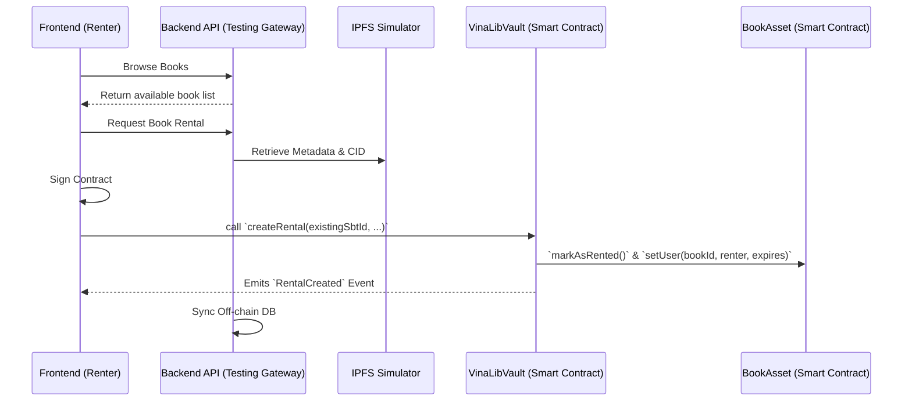
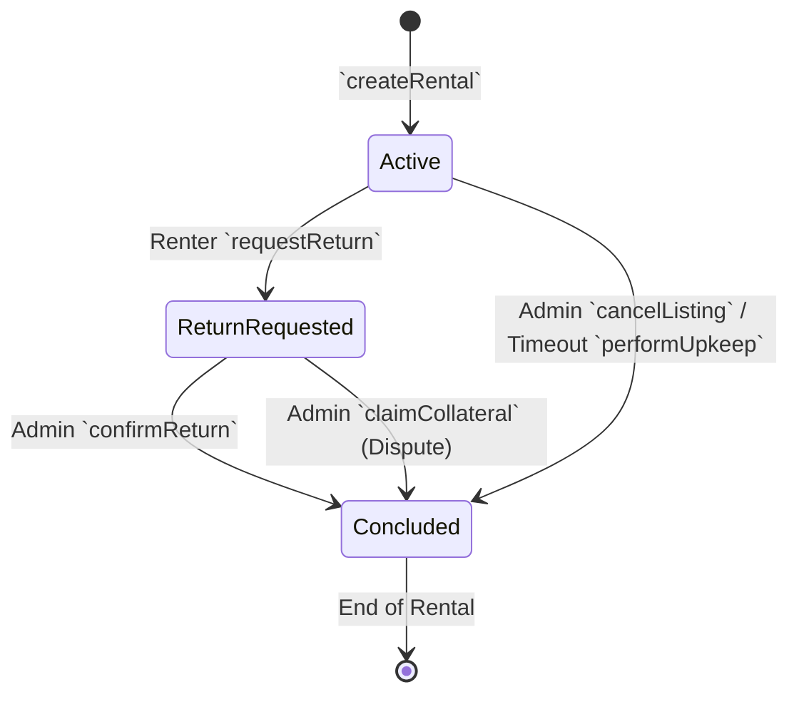

# BÁO CÁO PHÂN TÍCH KỸ THUẬT DAPP V3.1
**Phiên bản:** 3.1.0  
**Ngày cập nhật:** 2026-02-28  
**Thực thi từ:** Workflow QuyTrinhPhanTichDApp (REVIEW_UPDATE Mode)

---

## 1. PHÂN TÍCH KỸ THUẬT (Source Code Deconstruction)

### 1.1 Ma Trận Phân Quyền (Access Control Matrix)

| Contract | Role / Account | Permissions |
| :--- | :--- | :--- |
| **VinaLibVault** | `owner` (Admin) | `setConfig`, `sendRequest`, `setContracts`, `confirmReturn`, `cancelListing`, `claimCollateral` |
| **VinaLibVault** | `user` (Renter) | `createRental` (must match msg.sender), `requestReturn` (msg.sender == renter) |
| **VinaLibVault** | Chainlink Upkeep | `performUpkeep` (triggered automatically based on `checkUpkeep` condition) |
| **BookAsset** | `owner` (Admin) | `setRentalContract`, `safeMint`, `verifyForListing`, `verifyPreRent`, `pause`, `unpause` |
| **BookAsset** | `rentalContract` | `markAsRented`, `verifyReturn`, `setUser` (shared with Admin/Owner) |
| **RentalAgreementSBT** | `owner` (Admin) | `setRentalContract`, `safeMint` |
| **RentalAgreementSBT** | `rentalContract` | `safeMint` |
| **SuChinToken** | `owner` (Admin) | `mint` |

### 1.2 Endpoints & Mappings Chính

- **VinaLibVault:** 
  - Lưu trữ `EvidencePack` bằng Slot-packing optimization (termsHash, deliveryHash, renter, status, timestamps, pspRef).
  - Tích hợp **Chainlink Functions/Automation** với `checkUpkeep` trả về danh sách hết hạn.
- **BookAsset:**
  - Hoạt động theo chuẩn **ERC-4907** (Trao quyền sử dụng qua `setUser`, không mất bản quyền gốc).
  - Trạng thái máy (State Machine): `PendingVerification` → `Verified` → `Rented` → `Returned`.
- **RentalAgreementSBT:**
  - Standard Soulbound Token (SBT), override `_update` để khoá transfer. Lưu `termsHash`.

---

## 2. TRỪU TƯỢNG HÓA HỆ THỐNG (System Abstraction)

### 2.1 Sơ Đồ Data Flow Diagram (DFD)

### 2.2 Định Hình Lưu Trữ (Storage Mapping)
- **On-chain (Quy tắc & Sở hữu):** Ownership (NFT), Quyền tạm thời (ERC-4907 user), Trạng thái thuê, Mã băm tài liệu.
- **Off-chain (Dữ liệu nặng & Trải nghiệm):** Ảnh bìa/IPFS Metadata, Fiat payment states, User search index.

---

## 3. PHÂN TÍCH NGHIỆP VỤ (Business Modeling)

### 3.1 State Machine - Hợp đồng Thuê (Vault)

### 3.2 Định giá Gas Estimation (Core Tx)
- `createRental`: Cao (~ 150,000 - 180,000 Gas) do ghi nhiều mappings.
- `confirmReturn`: Trung bình cao (~ 100,000 - 120,000 Gas).
- `requestReturn`: Thấp (~ 45,000 - 60,000 Gas).
- Chi phí bảo trì `performUpkeep`: ~ 80,000 Gas + LINK Base fee.

---

## 4. KẾT LUẬN & CHUẨN HÓA

Toàn bộ tài liệu kỹ thuật của DApp đã được ráp nối hoàn chỉnh trong phiên bản v3.1. Các file tĩnh (phân rã step) đã được deprecated trên repository thư mục ngoài. Đảm bảo Single Source of Truth tập trung vào `BÁO_CÁO_PHÂN_TÍCH_DAPP_V3.1.md` và `SPEC_ĐẶC_TẢ_HỆ_THỐNG.md`.
